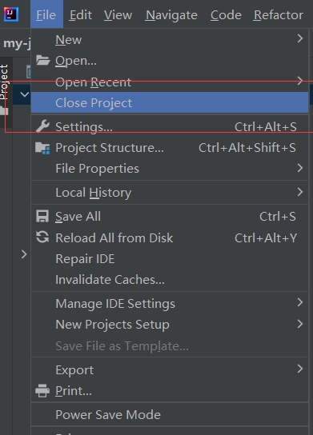
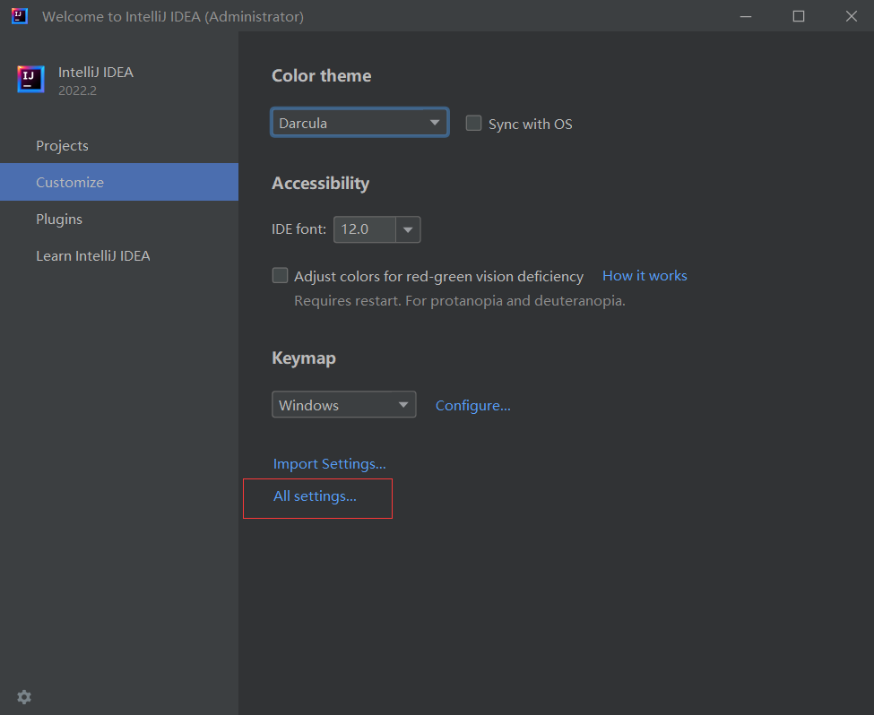
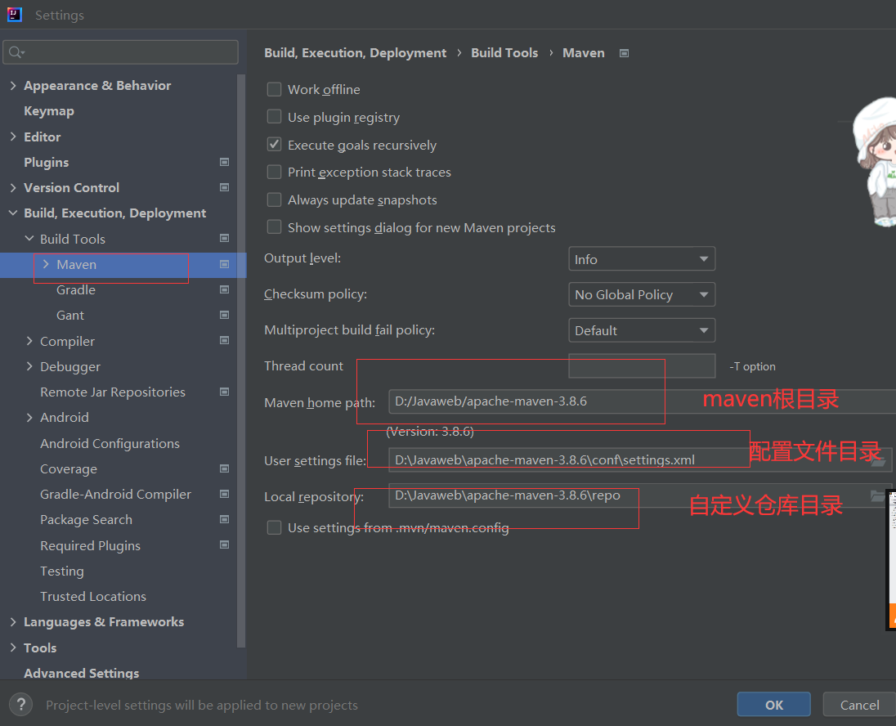
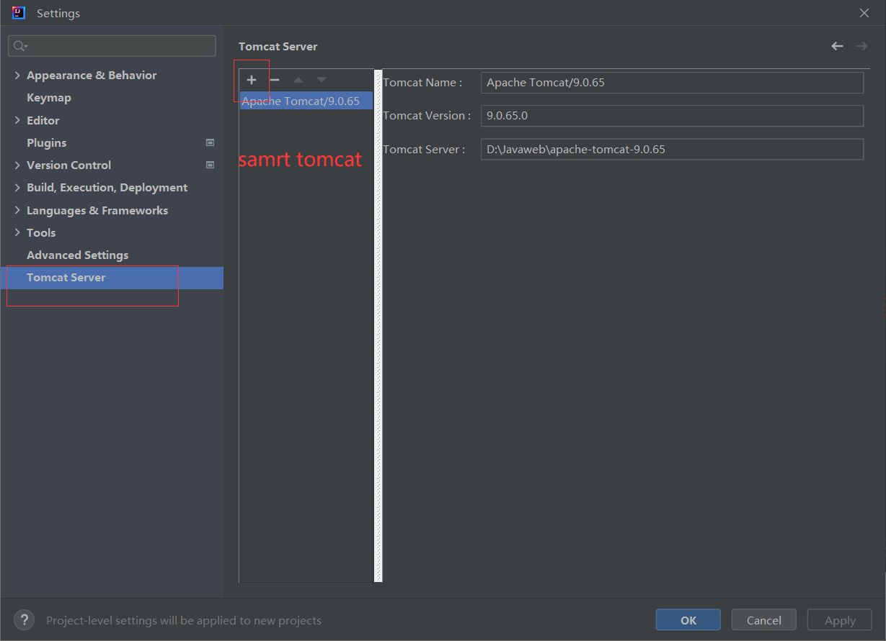
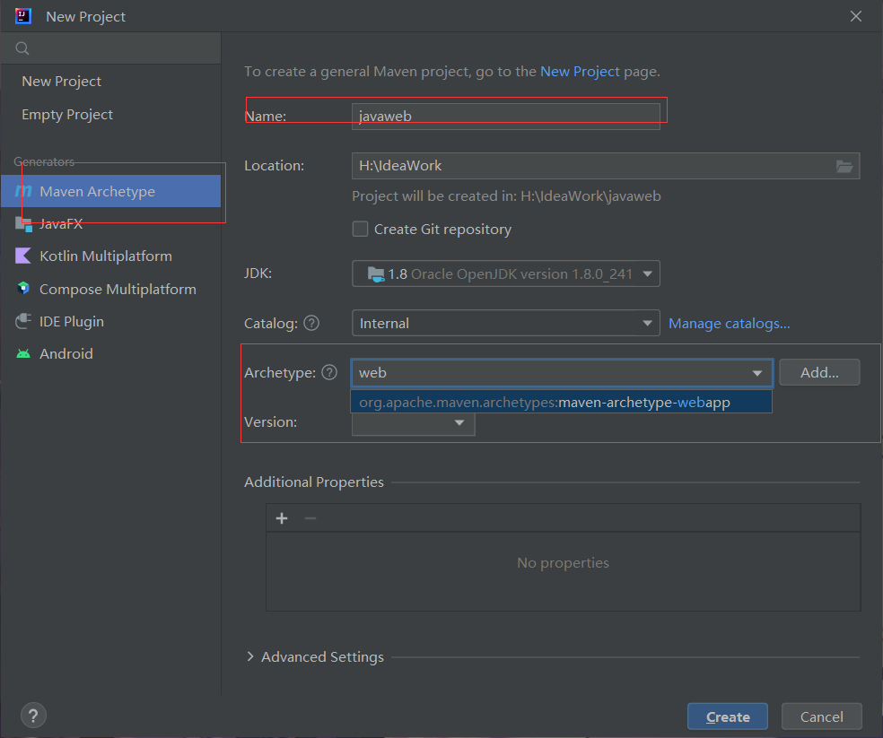
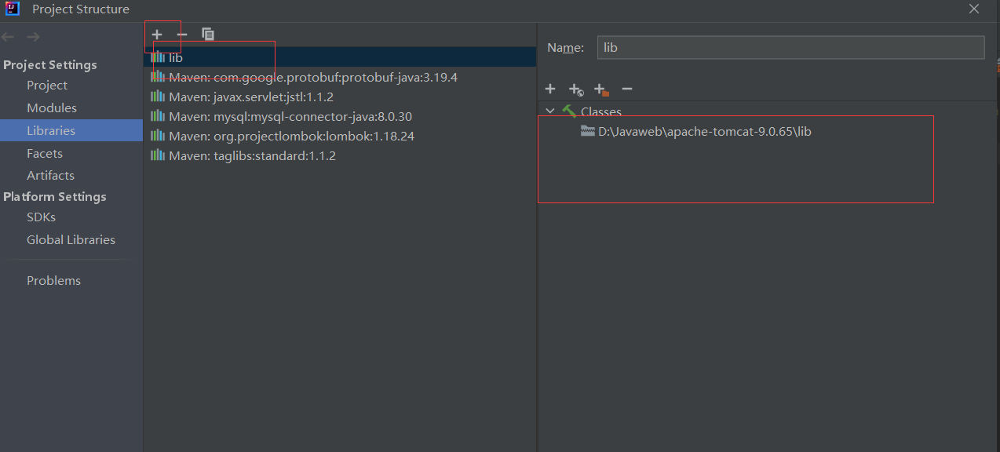
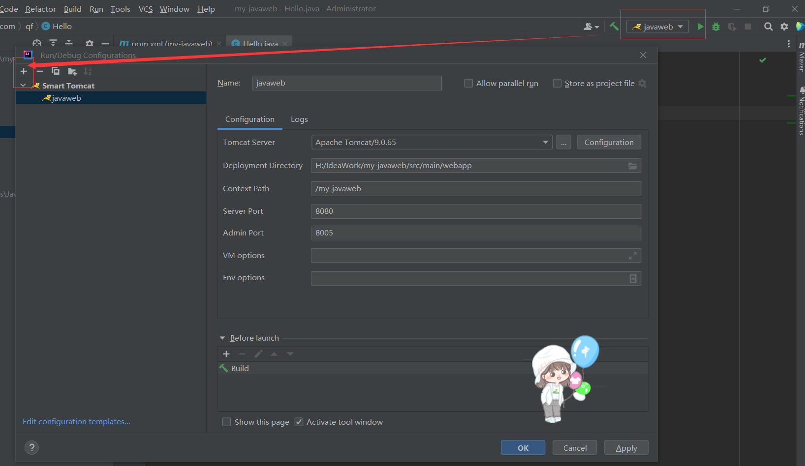
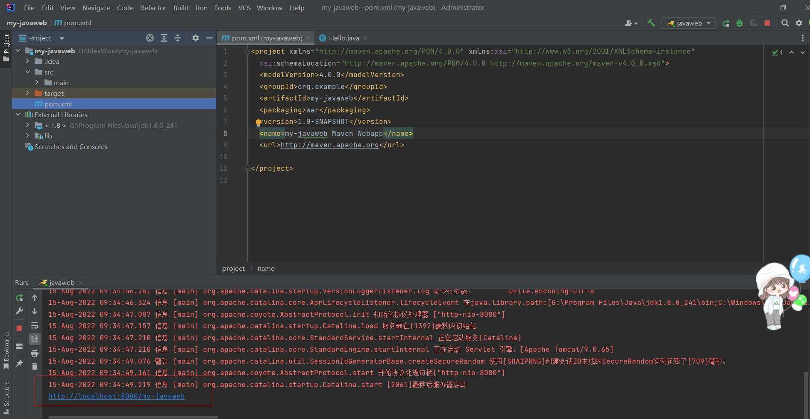
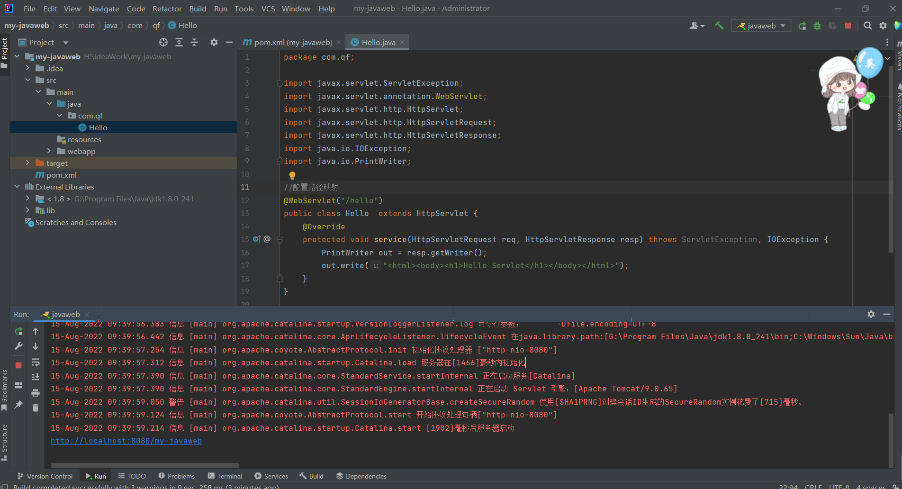
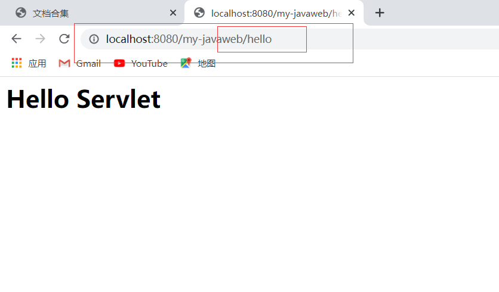

# JavaWeb

## 1.我的第一个 web 项目搭建（工具 IDEA）

#### （1）关闭当前项目，进入到最初界面




#### （2）配置 maven 和 tomcat 目录



- ##### **maven 的配置**



- ##### **tomcat 的配置**



### （3）新建项目 maven-archetype-webapp



### (4)项目里面的锤子配置 tomcat





### (5)点击链接到浏览器，我的一个 javaweb 就完成了



## 2.Servlet 的第一次体验





## 3.了解一下 Tomcat 运行工作原理

. bin 里面会存放 tomcat 自身运行所需的文件和脚本 conf 配置文件
·lib 项目所需的库
. webapps 项目一般是部署在这里的
· work 临时目录，主要存储 JSP 文件编译以后的内容

## 4.自定义 server 和浏览器

## 5.Servlet 下的 CRUD

1.导入需要的文件

上次的 jdbc 连接项目

2.创建 servlet 包与文件

```java
@WebServlet("/customers")
// http://localhost:8080/customers?flag=方法名
public class CustomersServlet extends HttpServlet {

    private CustomersDao dao = new CustomersDao();

    // CRUD 高类聚

    @Override // 路由：所有的关于customers的请求都是经由该方法派发出去，调用不同处理逻辑
    protected void service(HttpServletRequest req, HttpServletResponse resp) throws ServletException, IOException {
        String methodName = req.getParameter("flag");
        if ("findAll".equals(methodName)) {
            findAll(req, resp);
        }
    }

    private void findAll(HttpServletRequest req, HttpServletResponse resp) throws ServletException, IOException {
        try {
            // 查询数据
            List<Customers> list = dao.findAll("select * from customers", CustomersDao.mapper);
            // 把数据设置到作用域中
            req.setAttribute("customerList", list);
            // 执行页面跳转：转发
            // 获取转发器对象
            RequestDispatcher dispatcher = req.getRequestDispatcher("/customers.jsp");
            // 往前走
            dispatcher.forward(req, resp);
        } catch (SQLException e) {
            throw new RuntimeException(e);
        }
    }
```

3.创建 JSP 文件将控制台的内容显示在浏览器上

在`pom'中增加 3 个 lib

- MySQL 驱动
- Standard 库
- JSTL 库
  以上的三个'jar`需要手工拷贝到`apache-tomcat-9.0.65\lib`
  需要修改/WEB-INF/web.xml 头文件，参考 apache-tomcat-9.0.65\conf\web.xml

  4.解决 tomcat 编码问题
