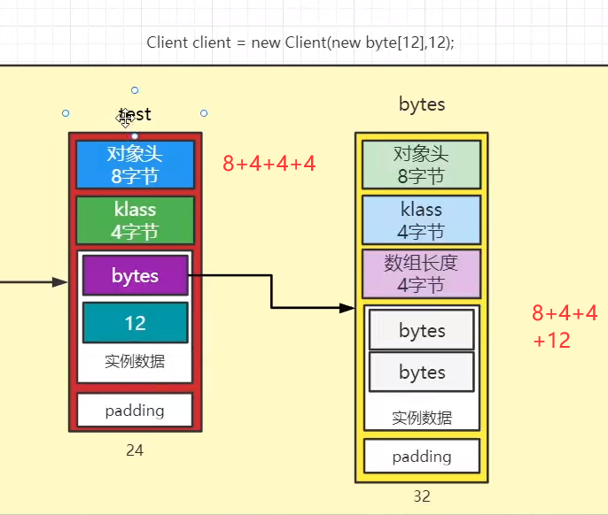
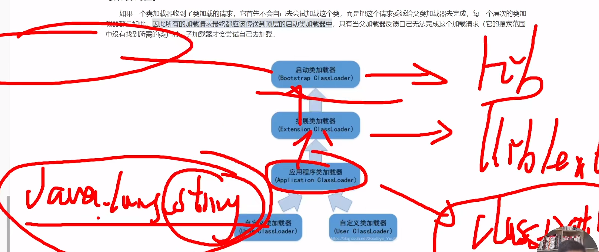

标记（根可达算法）复制（对象头的年龄+1）算法：频繁垃圾回收

标记整理算法：回收后对存活对象进行整理，节省内存

分代垃圾算法：不同的对象有不同的特点，分代之后再具体给他们分配垃圾回收方法

垃圾回收器（小程序）

java是一门编译与解释并存的语言 write once,run anywhere 

java编译生成字节码文件，由jvm解释执行。

java是一门静态类型的语言

静态就是声明变量时，已经确定了具体是哪一种语言

比如JavaScript就是一门动态类型的语言：var i; i="123";i=1;

对象的大小

类的加载好糊涂呀

通过全限定名获取二进制字节流，加载到方法区，然后在内存中生成class对象

加载、验证、准备（分配初始值）、解析（替换引用）、初始化（收集satic代码块和变量）

元：做描述的

双亲委派机制

都是一步一步找的，给父亲做，保证jdk的代码不被修改

