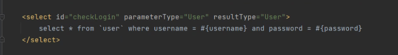

# MyBatis

面试宝典	下午4-6点抽查	紧迫感	面试  冲冲冲

mybatis初级高级->mybtisplus+spring

 curd	动态sql 

维基百科

## 一、简介

## 1.概述：

MyBatis是一个实现ORM半自动的框架（hibernate全自动）
ORM (object Relational Mapping)对象关系映射：解决面向对象和面向关系的对抗问题（理论显高级，很重要哇）

官网：https://mybatis.org/mybatis-3/zh/index.html

sql（struct query language）关系型（外键关联表）数据库（RDBMS）

涉及的知识点：

反射机制（获取类的相关信息或扫描包）MapperRegistry 如：

```xml
 <package name="com.qf.mybatis.mapper"/>
```

IO(mybatis-config.xml资源转换为流)

注解（解析处理数据库字段和java类属性的映射）

## 2.快速开始：

需要在`resources`下创建一个配置文件

```xml
<?xml version="1.0" encoding="UTF-8" ?>
<!DOCTYPE configuration
        PUBLIC "-//mybatis.org//DTD Config 3.0//EN"
        "http://mybatis.org/dtd/mybatis-3-config.dtd">
<configuration>
    <typeAliases>
        <!--给类型取简单的别名-->
        <typeAlias alias="Office" type="com.qf.pojo.Office"/>
        <typeAlias alias="User" type="com.qf.pojo.User"/>
    </typeAliases>
    <!--可以配置多个描述DB的环境-->
    <environments default="mysql_hr">
        <environment id="mysql_hr">
            <!--事务管理默认使用JDBC的事务-->
            <transactionManager type="JDBC"/>
            <!--mybatis会使用一个轻量级的数据库连接池来管理连接-->
            <dataSource type="POOLED">
                <property name="driver" value="com.mysql.cj.jdbc.Driver"/>
                <property name="url" value="jdbc:mysql://localhost:3306/sql_hr?rewriteBatchedStatements=true&amp;serverTimezone=GMT%2B8&amp;characterEncoding=utf8"/>
                <property name="username" value="root"/>
                <property name="password" value="admin"/>
            </dataSource>
        </environment>
      
    </environments>
</configuration>
```

> &需要使用 `&amp;`转义

该文件主要帮助框架获取连接数据库的主要信息（JDBC4要素）

```java
String resource = "mybatis/mybatis-config.xml";
// 从配置文件中获取连接DB的重要信息（JDBC的4要素）
InputStream inputStream = Resources.getResourceAsStream(resource);
// 创建一个类似于DbUtils的工具类，它主要用来创建操作mybatis的api的session（对应jdbc的connection）
SqlSessionFactory sqlSessionFactory = new SqlSessionFactoryBuilder().build(inputStream);
System.out.println(sqlSessionFactory);
```

`SqlSessionFactory`主要职责是创建出会话工厂，而会话（session）相当于JDBC中的连接（connection）

## 二、基于映射文件的实现

映射文件主要描述`DB`的字段和`Java`属性之间的对应关系，然后还有众多的`SQL`

>parameterType:参数类型
>
>resultType：返回的结果集类型
>
>resultMap:可以自定义映射关系	属性：>id result属性：>property column
>
>多表连接返回hashmap键值对 别名为准 map.get(key别名)

```xml
<?xml version="1.0" encoding="UTF-8" ?>
<!DOCTYPE mapper
        PUBLIC "-//mybatis.org//DTD Mapper 3.0//EN"
        "http://mybatis.org/dtd/mybatis-3-mapper.dtd">
<mapper namespace="mybatis.user">

    <!--namespace形同Java中的package，只要具有唯一性就行-->

    <!--该映射文件有一些简单的关于DB的字段映射到Java属性的默认实现：从snake命名法转化为小驼峰命名法-->

    <!--自定义映射关系-->
    <resultMap id="userMap" type="User">
        <id property="id" column="id"/>
        <result property="username" column="username"/>
        <result property="password" column="password"/>
        <result property="roleId" column="role_id"/>
    </resultMap>

    <select id="checkLogin" parameterType="User" resultType="User">
        select * from `user` where username = #{username} and password = #{password}
    </select>

    <!--  select 1-->
    <select id="isDuplicate" resultType="int">
        select 1 from `user` where username = #{username}
    </select>

    <select id="findBundle" resultType="hashmap">
        select u.username uname, r.name rname from `user` u
        left join role r
        on u.role_id = r.id
        where u.id = #{id}
    </select>

    <insert id="save" parameterType="User">
        insert into `user` values(null, #{username}, #{password}, #{roleId})
    </insert>


</mapper>
```

同时，一定要记得在配置文件中，注册该映射文件

```xml
    <mappers>
        <mapper resource="mybatis/mapper/UserMapper.xml"/>
    </mappers>
```

测试代码

```java
        try (
                SqlSession session = SqlSessionUtils.getSession()
        ) {
            // 参数1：在映射文件中的SQL语句的ID
            // 参数2：提交给#{id}这个占位符的实参
            //List<Map<String, Object>> list = session.selectList(NS + ".findBundle");
            //List<Object> list = session.selectList(NS + ".findBundle");
             Map<String, Object> map = session.selectOne( "mybatis.user.findBundle", 1);
             System.out.println(map.get("uname"));
            System.out.println(map.get("rname"));
            //System.out.println(list);
         
        }
```

增删改都需要commit

parameterType	 resultType



## 三、基于注解的实现

编写相应的查询接口

```java
public interface OfficeMapper {

    @Select("select * from offices where office_id = #{id}")
    Office findById(Integer id);

}
```

在mybatis配置文件中对该接口进行注册

```xml
    <mappers>
		<!--<mapper resource="mybatis/mapper/OfficeMapper.xml"/>-->
        <package name="com.qf.mybtis.mapper"/>
    </mappers>
```

使用接口的风格进行查询

```java
        try (
                SqlSession session = SqlSessionUtils.getSession()
        ) {
            // OfficeMapper mapper = session.getMapper(OfficeMapper.class);
            // Office office = mapper.findById(1);
            // System.out.println(office);
            UserMapper mapper = session.getMapper(UserMapper.class);
            User user = mapper.findById(1);
            System.out.println(user);
        }
```

> 使用Mapper风格进行查询的时候，框架不会对snake命名做默认的映射,需要自己定义注解@results(id,value)

#{java属性名}


@param（参数）来自@select#{参数}


复用映射关系 id="userMap"


delete from表名where条件;

update表名set ... where条件;.

select ... from表名where条件;

select * from表名where条件order by列名 asc|desc;: order by列名表示将查询结果按照指定的列排序。asc按照指定的列升序(默认)
。desc按照指定的列降序

## 四、日志实现

>log4j2.xml	日志等级 debug info warn error

```xml
<?xml version="1.0" encoding="UTF-8"?>
<Configuration>
    <Appenders>
        <Console name="Console" target="SYSTEM_OUT">
            <!-- 日志等级 debug info warn error -->
            <PatternLayout pattern="%d{YYYY-MM-dd HH:mm:ss} [%t] %-5level %logger{36} - %msg%n"/>
        </Console>
    </Appenders>

    <Loggers>
        <Logger name="com.example" level="INFO"/>
        <Root level="debug">
            <AppenderRef ref="Console"/>
        </Root>
    </Loggers>
</Configuration>
```

>mybatis-config.xml   使用log.debug/error

```xml
    <settings>
       // <setting name="logImpl" value="STDOUT_LOGGING"/>
        <setting name="logImpl" value="LOG4J2"/>
    </settings>
```

## 五、关联映射

## 六、动态SQL

## 七、SQL的笔记

### 1.简单单表

增删改查，分组都可以搞定


### 2.多表查询

>select ... from表1 inner/left/right join表2 on匹配条件 [where筛选条件];

左连接:显示左表中的所有数据，如果在有右表中存在与左表记录满足匹配条件的数据，则进行匹配;如果右表中不存在匹配数据，则显示为null，右连接相反


### 3.视图（查出来的虚拟中间表）查询

### 4.索引查询

>create (unique) index index_name on表名(列名);