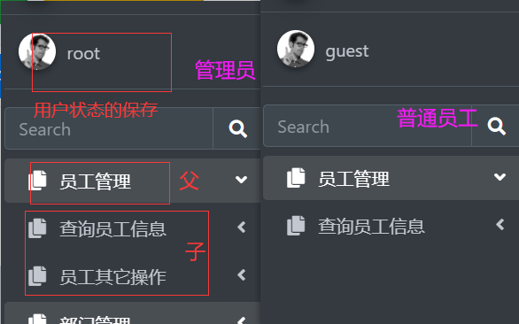
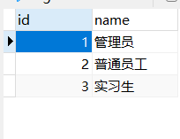
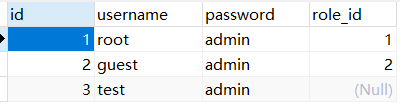
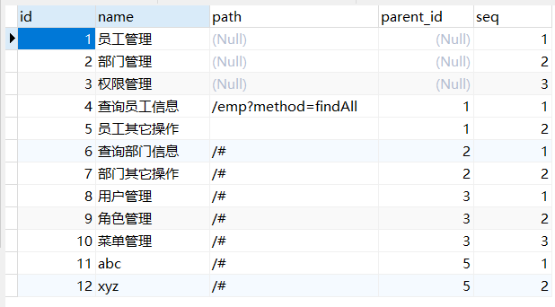
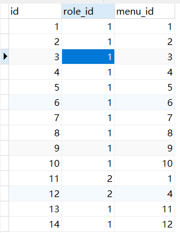
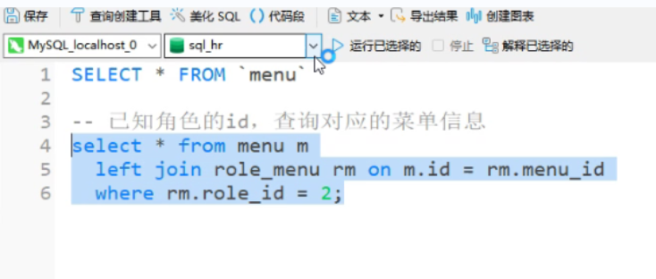
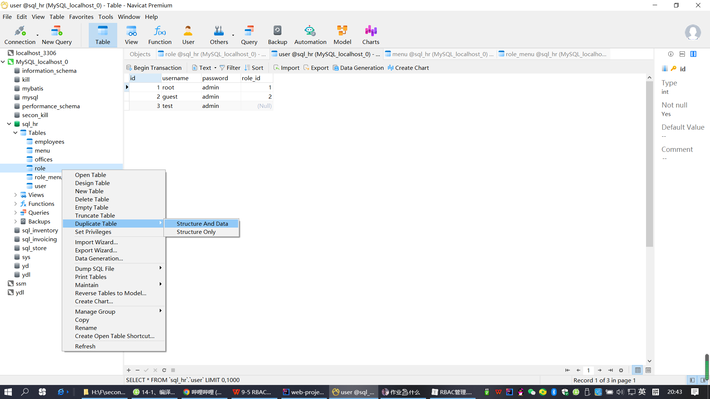

# RBAC权限管理

**效果图**



## 1.建模

`Role-Based Access Control`，翻译成基于角色的访问控制系统。

### 1.1角色表`Role`

| 列名 | 说明     |
| ---- | -------- |
| id   | 主键     |
| name | 角色名称 |



### 1.2用户表`User`

| 列名     | 说明                                      |
| -------- | ----------------------------------------- |
| id       | 主键                                      |
| username | 用户名                                    |
| password | 密码                                      |
| role_id  | 对应的角色编号（外键一般都设置在N这一方） |



### 1.3菜单表示“权限”，`Menu`

| 列名      | 说明                                       |
| --------- | ------------------------------------------ |
| id        | 主键                                       |
| name      | 菜单节点的名称                             |
| path      | 菜单路径                                   |
| parent_id | 父菜单节点的编号，关联另一个菜单节点的编号 |



**借助role_menu辅助表来实现表与表之间的关联**

比如1号角色有菜单123456.所有的操作权限，而2号角色只有1员工管理4查询员工的操作权限



> 这张表seq只得是菜单栏的层级关系

### 1.4数据库表的测试（select）

多个表的连接



到处数据库包括建表的操作



### 问：菜单来表示“权限”，有何优缺点？

缺点是没用操作用户页面的颗粒度，比如某某页面的按钮功能不能操作

优点是对于很多权限可一次性授予，调整权限也是统一受到影响

## 2.鉴权和授权逻辑的编写

#### 2.1递归的使用

#### 2.2ajax请求与自调用

```js
let loadMenu = () => {
    // 先到sessionStorage中去get
    // Y handleMenus
    // N 发送异步请求获得菜单数据
    $.get(
        "/user",
        { method: "loadMenus" },
        (menus) => {
            handleMenus(menus);
        }
    );
};

loadMenu();

```

#### 2.3流式编程与filter

```java 
private static void loadChildren(List<Menu> parentList, List<Menu> menuList) {
    
    parentList.forEach(parent -> {
        // 到menuList中查找，哪些元素是parent的子节点
        List<Menu> children = menuList.stream()
            .filter(menu -> menu.getParentId() == parent.getId())
            .sorted(Comparator.comparing(Menu::getSeq))
            .collect(Collectors.toList());
        parent.setChildren(children);
        // loadChildren(children, menuList);

        List<Menu> collect = children.stream().filter(menu -> menu.getPath() == null).collect(Collectors.toList());
        loadChildren(collect, menuList);
    });
}
```

`release/rbac`

在登录之后，将含有角色信息的`user`对象存储在`session`中

```java
if (loginUser != null) {
    msg = "SUCCESS";
    // 把用户的信息保存在session中，以便后续在filter中进行校验是否是登录用户

    HttpSession session = req.getSession();
    session.setAttribute("userInSession", loginUser);

    // 根据用户名获取他的角色

} else msg = "FAILURE";
```

编写组装菜单的方法，向前端以`JSON`格式输出菜单数据

>把所有父亲的儿子找出来给他放自己袋子里
>
>儿子还得继续找孙子，直到子子孙孙找完了（x.id=y.id）

```java
private void loadMenus(HttpServletRequest req, HttpServletResponse resp) {
    try {
        // 根据登录用户的信息（角色），获取对应的菜单集合信息，然后输出到前端
        User loginUser = (User) req.getSession().getAttribute("userInSession");
        // 查询出来的菜单信息是平行结构
        List<Menu> menuList = menuDao.loadMenus(loginUser.getRoleId()); // roleId = 1 size = 12
        // 安排层级关系
        List<Menu> menus = handleMenus(menuList); // size = 3
        JsonUtils.writeJSON(menus, resp);
    } catch (SQLException | IOException e) {
        e.printStackTrace();
        throw new RuntimeException(e);
    }
}

private List<Menu> handleMenus(List<Menu> menuList) {
    // parenId == null 根节点
    List<Menu> menus = findRoot(menuList); // 有3个根节点
    // path == null 有子节点
    loadChildren(menus, menuList);
    return menus;
}

private static List<Menu> findRoot(List<Menu> menuList) {
    return menuList.stream().filter((menu -> menu.getParentId() == null || menu.getParentId() == 0)).collect(Collectors.toList());
}

private static void loadChildren(List<Menu> parentList, List<Menu> menuList) {
    
    parentList.forEach(parent -> {
        // 到menuList中查找，哪些元素是parent的子节点
        List<Menu> children = menuList.stream()
            .filter(menu -> menu.getParentId() == parent.getId())
            .sorted(Comparator.comparing(Menu::getSeq))
            .collect(Collectors.toList());
        parent.setChildren(children);
        // loadChildren(children, menuList);

        List<Menu> collect = children.stream().filter(menu -> menu.getPath() == null).collect(Collectors.toList());
        loadChildren(collect, menuList);
    });
}
```

前端

首先找到菜单的挂载点，修改为：

```html
<nav class="mt-2">
    <ul id="treeMenu" class="nav nav-pills nav-sidebar flex-column" data-widget="treeview" role="menu"
        data-accordion="false">
    </ul>
</nav>
```

通过异步请求的方式，装载和组装数据

```javascript
let loadMenu = () => {
    // 先到sessionStorage中去get
    // Y handleMenus
    // N 发送异步请求获得菜单数据
    $.get(
        "/user",
        { method: "loadMenus" },
        (menus) => {
            handleMenus(menus);
        }
    );
};

loadMenu();

let handleMenus = (menus) => {
    // 定位菜单的挂载点
    const root = $("#treeMenu");
    root.empty();
    findChildren(root, menus);
};

let findChildren = (parent, children) => {
    for (const menu of children) {
        // 创建菜单DOM节点
        let textNode =
            $(`<li class="nav-item">
              <a href="${menu.path}" class="nav-link">
                <i class="nav-icon fas fa-copy"></i>
                <p>
                  ${menu.name}
                  <i class="fas fa-angle-left right"></i>
                </p>
              </a>
            </li>`);
        parent.append(textNode);

        // 判断当前的menu对象是否有小孩
        if (menu.children) {
            // 先给孩儿们创建一个挂载点
            let next = $('<ul class="nav nav-treeview"></ul>');
            textNode.append(next);
            findChildren(next, menu.children);
        }
    }
};
```

## 3.GSON的使用

**实现json格式与java字符串格式转换**

### 3.1导入

```xml
<dependency>
            <groupId>com.google.code.gson</groupId>
            <artifactId>gson</artifactId>
            <version>2.8.9</version>
</dependency>
```

### 3.2编写工具类代码JSONUtils

```java 
package com.qf.utils;

import com.google.gson.Gson;

import javax.servlet.http.HttpServletResponse;
import java.io.IOException;
import java.io.PrintWriter;

public class JsonUtils {

    private static final Gson gson = new Gson();

    public static void writeJSON(Object data, HttpServletResponse resp) throws IOException {
        // 设置编码
        // resp.setCharacterEncoding("utf-8");
        resp.setContentType("text/json;charset=utf-8");
        // 获取到out对象
        PrintWriter writer = resp.getWriter();
        String json = gson.toJson(data);
        writer.write(json);
        writer.close();
    }

    public static void writePlain(String data, HttpServletResponse resp) throws IOException {
        // 设置编码
        // resp.setCharacterEncoding("utf-8");
        resp.setContentType("text/plain;charset=utf-8");
        // 获取到out对象
        PrintWriter writer = resp.getWriter();
        writer.write(data);
        writer.close();
    }

}

```

## 4.过滤器的使用

### 4.1	步骤：	

1.实现Filter(javax.servlet包)

2.请求、响应类型转换（HttpServletRequest	HttpServletResponse）

3.逻辑处理（比如请求响应转码，又比如获取登录SessionId）

4.链式调用：filterChain.doFilter(req, resp);

### 4.2	对请求响应字符编码处理完整实例

```java 
@WebFilter("/*")
public class CharacterEncodingFilter implements Filter {
    @Override
    public void doFilter(ServletRequest servletRequest, ServletResponse servletResponse, FilterChain filterChain) throws IOException, ServletException {
        HttpServletRequest req = (HttpServletRequest) servletRequest;
        HttpServletResponse resp = (HttpServletResponse) servletResponse;

        // 对请求转码
        req.setCharacterEncoding("utf-8");
        // 对响应转码
        resp.setCharacterEncoding("utf-8");

        filterChain.doFilter(req, resp);
    }
}
```

### 4.3	会话保存

通过设置sessionid,只要用户的页面不关闭，解决了不用登录直接进入首页的问题

对静态资源目录进行过滤，满足用户SessionId不为空才放行，注意不要把其他文件放在此目录下以免造成文件被过滤掉的问题，此文件夹下`只存放了静态页面`

```
@WebFilter("/adminlte/site/*")
```

获取`SessionId`，对登录进行过滤

```Java
 Object user = req.getSession().getAttribute("userInSession");
 if(user != null){
            // 放行
       filterChain.doFilter(servletRequest, servletResponse);
  }else{
        resp.sendRedirect("/adminlte/login.html");
  }
```

