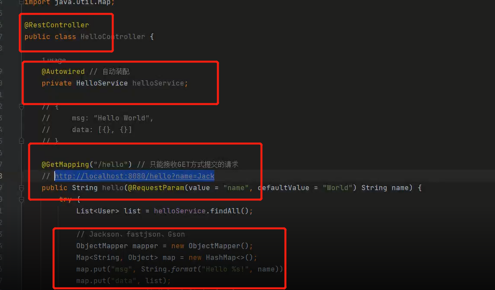
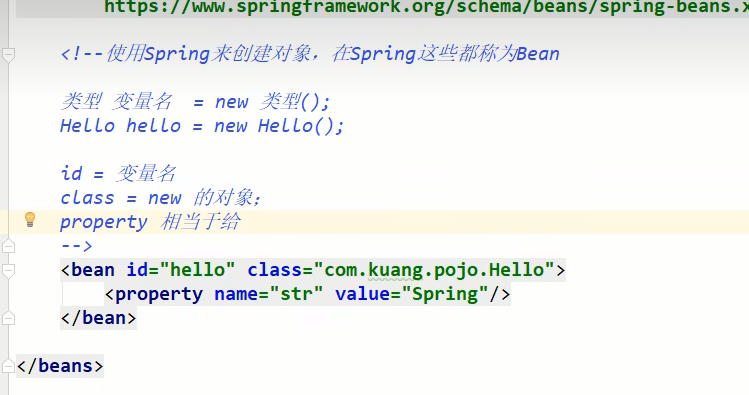
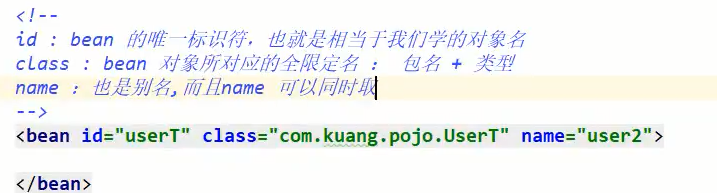

Spring

start.aliyun.com->脚手架

spring编写代码基本步骤

spring管理 	自动装配new	jackson

注入

控制反转IOC：不用再创建对象了，不由程序员创建修改

·之前，程序是主动创建对象!控制权在程序猿手上!
·使用了set注入后，程序不再具有主动性，而是变成了被动的接受对象!
这种思想，从本质上解决了问题，我们程序猿不用再去管理对象的创建了。系统的耦合性大大降低~
可以更加专
注的在业务的实现上!这是IOC的原型!

xml

servlet由tomcat创建，可以转发数据到前端，当然filter也是可以的

清缓存