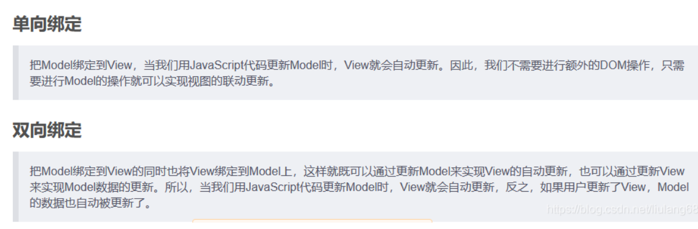
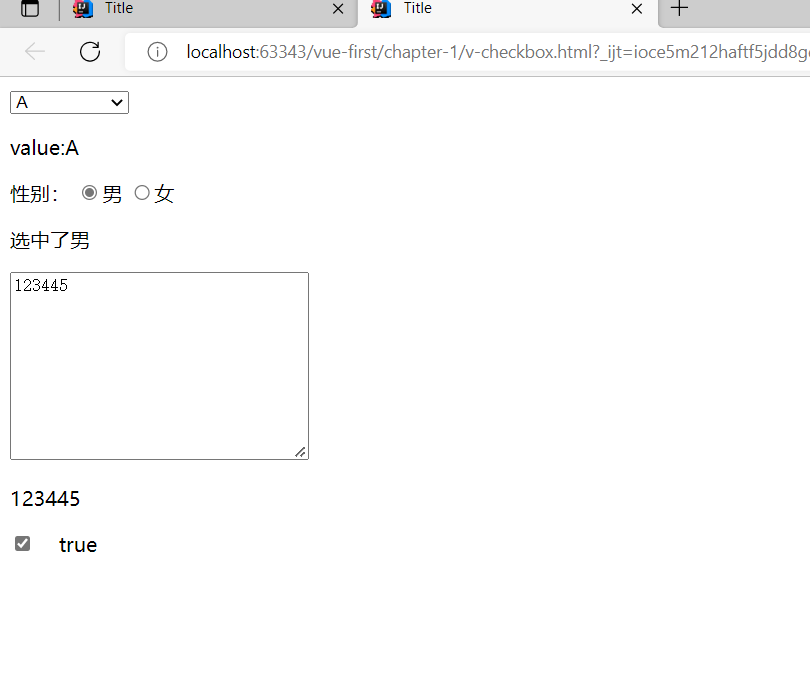
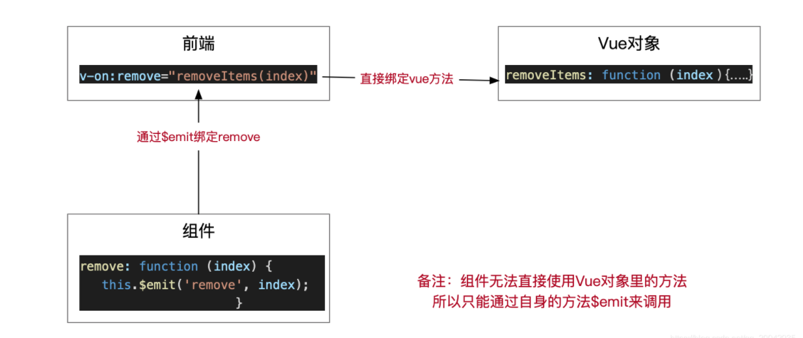
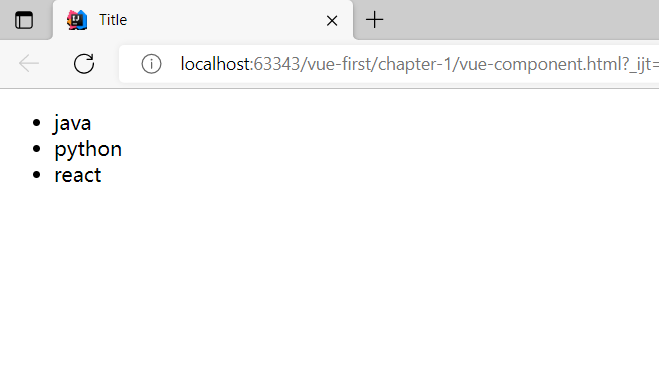
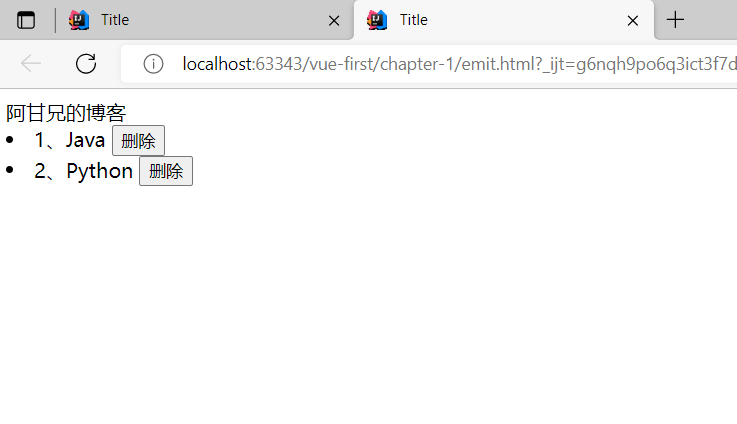
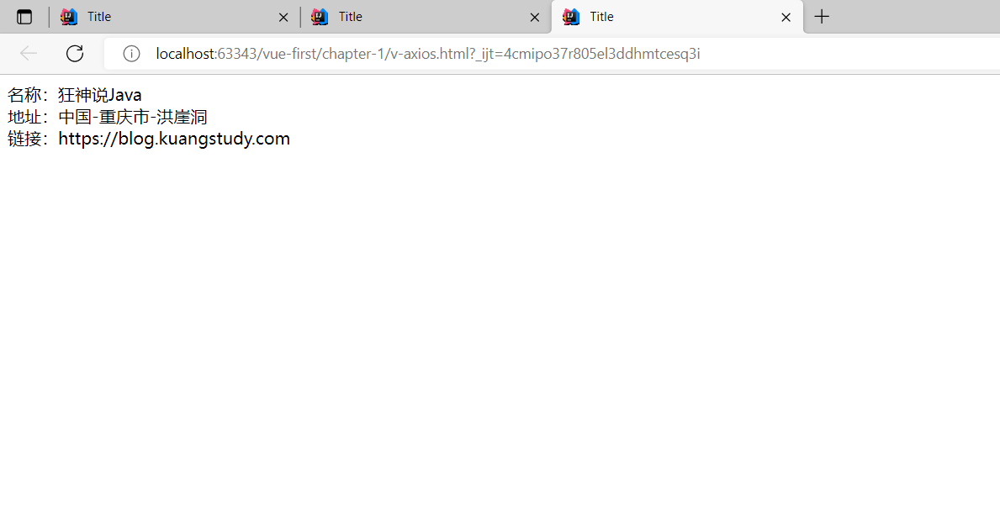

## VUE

```
el:"#app"

data:{

}

methods:{

}
```

### 1.取值:使用插值表达式

{{msg}}

### 2.绑定事件

单向绑定 v-bind:属性=""	 :属性

事件绑定：v-on:事件=“” 	@事件

双向绑定 v-model:

区别：单向绑定当我们改view的时候，[model](https://so.csdn.net/so/search?q=model&spm=1001.2101.3001.7020)是不会改变的。改view的时候model是不会变的。双向绑定以后就会变了



```html
<!DOCTYPE html>
<html lang="en">
<head>
    <meta charset="UTF-8">
    <title>Title</title>
</head>
<body>
<div id="app">
    <select v-model="selected">
        <option value="">---请选择----</option>
        <option value="A">A</option>
        <option value="B">B</option>
        <option value="C">C</option>
    </select>
    <p>value:{{selected}}</p>
    性别：
    <input type="radio" name="sex" value="男" v-model="ss">男
    <input type="radio" name="sex" value="女" v-model="ss">女
    <p>选中了{{ss}}</p>
    <textarea name="" id="" cols="30" rows="10" v-model="message"></textarea>
    <p>{{message}}</p>
    <input type="checkbox" id="checkbox" v-model="checked">
    &nbsp;&nbsp;
    <label for="checkbox">{{checked}}</label>
</div>
<script src="https://cdn.jsdelivr.net/npm/vue@2.5.21/dist/vue.js"></script>
</body>
<script type="text/javascript">
    var vm = new Vue({
        el:'#app',
        data:{
            checked:false,
            message:123,
            ss:'',
            selected:'',
        }
    })
</script>
</html>
```



### 3.组件、插槽

> vue.component("组件名字",{
>
> template:模板
>
> })

>组件传值 v-bind

>组件内部绑定事件需要使用到 this.$emit("事件名",参数)



```html
<!DOCTYPE html>
<html lang="en">
<head>
    <meta charset="UTF-8">
    <title>Title</title>
</head>
<body>
<div id="app">
    <ul>
        <!--绑定值传给自定义组件-->
        <my-component-li v-for="item in items" v-bind:value="item"></my-component-li>
    </ul>
</div>
<script src="https://cdn.jsdelivr.net/npm/vue@2.5.21/dist/vue.js"></script>
</body>
<script type="text/javascript">
    Vue.component('my-component-li',{
        props:['value'],
        template:'<li>{{value}}</li>'
    });
    var vm = new Vue({
        el:'#app',
        data:{
           items:['java','python','react']
        }
    })
</script>
</html>
```



```html
<!DOCTYPE html>
<html lang="en">

<head>
    <meta charset="UTF-8">
    <title>Title</title>
    <!--引入js文件-->
    <script src="https://cdn.jsdelivr.net/npm/vue@2.5.21/dist/vue.min.js"></script>
</head>

<body>
<!--view层，模板-->
<div id="app">
    <article>
        <aritcle-title slot="todo-title" v-bind:title="title"></aritcle-title>
        <aritcle-content slot="aritcle-content" v-for="(item,index) in contents" :item="item" :index="index"
                         v-on:remove="removeItems(index)">
        </aritcle-content>
    </article>

</div>


<script type="text/javascript">
    Vue.component('aritcle', {
        template: '<div>\
                <slot name="aritcle-title"></slot>\
                <ul>\
                    <slot name="aritcle-content"></slot>\
                </ul>\
            </div>'
    });
    Vue.component('aritcle-title', {
        props: ['title'],
        template: '<div>{{title}}</div>'
    });
    //这里的index，就是数组的下标，使用for循环遍历的时候，可以循环出来！
    Vue.component("aritcle-content", {
        props: ["item", "index"],
        template: "<li>{{index+1}}、{{item}} <button @click='remove()'>删除</button></li> ",
        methods: {
            remove: function (index) {
                this.$emit('remove', index);
            }
        }
    });

    var vm = new Vue({
        el: "#app",
        data: {
            title: "阿甘兄的博客",
            contents: ['Java', 'Python', 'Vue']
        },
        methods: {
            removeItems: function (index) {
                console.log("删除了" + this.contents[index] + "OK");
                this.contents.splice(index, 1);
            }
        }
    });
</script>
</body>

</html>

```



>
>
><slot></slot>都要有属性，表名是哪一个插槽

```html
<!DOCTYPE html>
<html lang="en">
<head>
    <meta charset="UTF-8">
    <title>Title</title>
</head>
<body>
    <div id="app">
        <todo>
            <todo-title slot="todo-title" title="秦老师系列课程"></todo-title>
            <todo-items slot="todo-items" v-for="(item,index) in todoItems" v-bind:item="item" v-bind:index="index"></todo-items>
        </todo>
    </div>
    <script src="https://cdn.jsdelivr.net/npm/vue@2.5.21/dist/vue.js"></script>
</body>
<script>
    Vue.component('todo',{
        template:'<div>' +
                    '<slot name="todo-title"></slot>' +
                        '<ul>' +
            '<slot name="todo-items"></slot>' +
            '</ul>' +
            '</div>'
    }),
    Vue.component('todo-title',{
       props:['title'],
        template:'<div>{{title}}</div>'
    }),
    Vue.component('todo-items',{
        props:['item','index'],
        template:'<li>{{index+1}}.{{item}}</li>'
    });
        var vm = new Vue({
            el:'#app',
            data:{
                todoItems:['狂神说java','狂神说运维','狂神说前端']
            }
        })
</script>
</html>
```

### 4.方法与属性computed

调用方法XX() 调用属性XX

```html
<!DOCTYPE html>
<html lang="en">
<head>
    <meta charset="UTF-8">
    <title>Title</title>
</head>
<body>
<div id="app">
    <p>调用当前时间的方法：{{currentTime1()}}</p>
    <p>当前时间的计算属性：{{currentTime2}}</p>
</div>
<script src="https://cdn.jsdelivr.net/npm/vue@2.5.21/dist/vue.js"> </script>
<script>
    var vm = new Vue({
        el:'#app',
        data:{
            message:'hello vue'
        },
        methods:{
            currentTime1:function () {
                return Date.now();
            },

            },
        computed:{
            currentTime2:function () {
                this.message;
                return Date.now();
            }
        }
    })
</script>
</body>
</html>
```

### 5.路由axios:

### mounted（）方法发送请求将数据用return返回

```html
<!DOCTYPE html>
<html lang="en" xmlns:v-bind="http://www.w3.org/1999/xhtml">
<head>
    <meta charset="UTF-8">
    <title>Title</title>
</head>
<body>
<div id="app">
    <div>名称：{{info.name}}</div>
    <div>地址：{{info.address.country}}-{{info.address.city}}-{{info.address.street}}</div>
    <div>链接：<a v-bind:hred="info.url" target="_blank">{{info.url}}</a></div>
</div>
<script src="https://cdn.jsdelivr.net/npm/vue@2.5.21/dist/vue.js"></script> <script src="https://unpkg.com/axios/dist/axios.min.js"></script>
</body>
<script type="text/javascript">
var vm = new Vue({
    el: '#app',
    data() {
        return {
            info: {
                name: null,
                address: {
                    country: null,
                    city: null,
                    street: null
                },
                url: null
            }
        }

    },
    mounted()
    {
        axios.get('data.json').then(response => {
            this.info=response.data;
        })
    }

})
</script>
</html>
```



