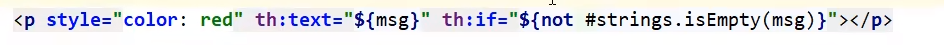
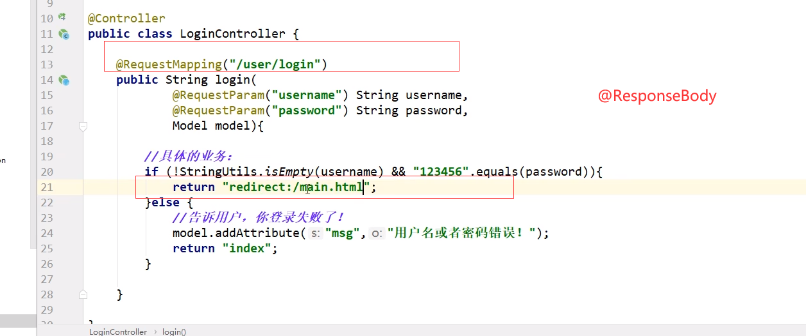
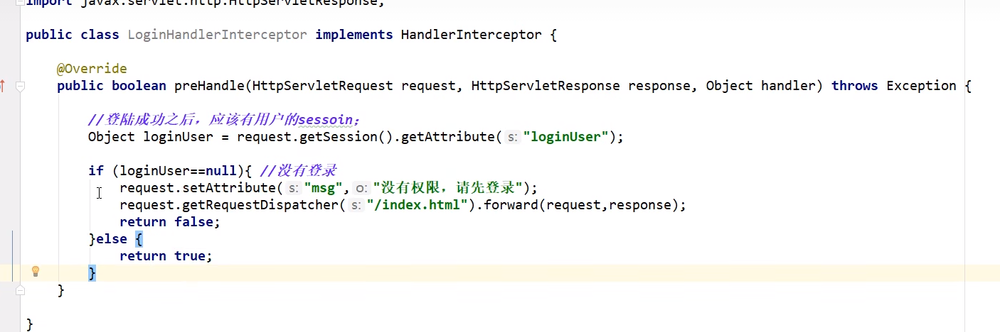
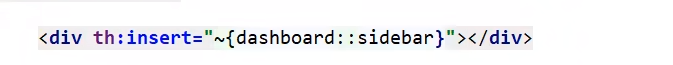
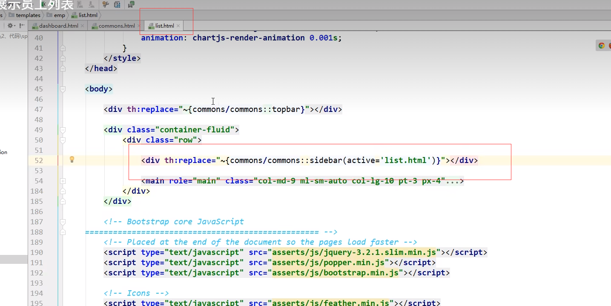
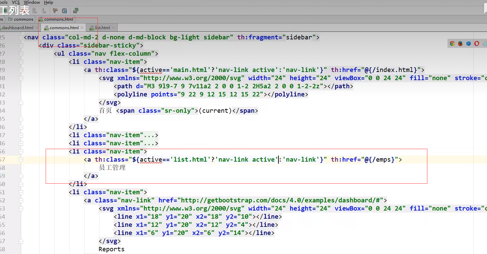
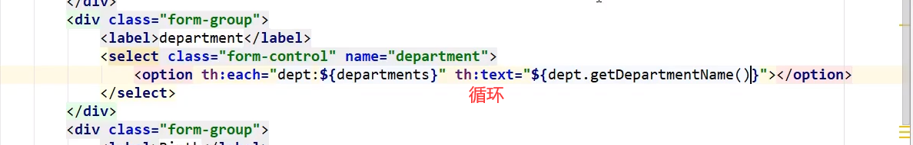
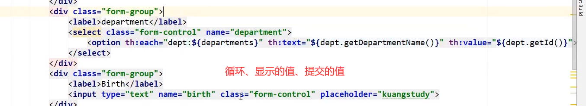

springboot项目

bootstrap模板


department id departName

employee id lastName email gender departmennt birth

dao->mapper

自己造一个假的数据库 Dao层交给spring托管@Repository


造假的增删改查


链接：th:href="@{/css/bootstrap.css}"

文本：th:text="#{login.tip}"

提示：th:placeholder="#{login.password}"

按钮 与input输入框：[[#{login.btn}]]

国际化配置

```
<a class="btn btn-sm" th:href="@{/index.htm1(-'zh_CN')}">中文</a>
<a class="btn btn-sm" th:href="@{/index.htm1(1='en_us ' )} ">English</a>

```

1.首页配置:注意点，所有页面的静态资源都需要使用thymeleaf接管;@.页面国际化︰
1.我们需要配置i18n文件
2我们如果需要在项目中进行按钮自动切换，我们需要自定义一个组件LocaleResolver3.记得将自己写的组件配置到spring容器@Bean I

登录

密码错误  form表单的action请求 要有name



重定向



登录拦截器

在controller层把seesion.setAttribute("loginUser",username)



页面复用

th:fragment="sidebar"



激活







