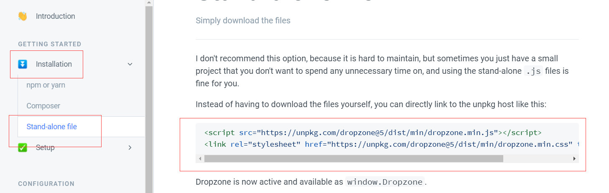
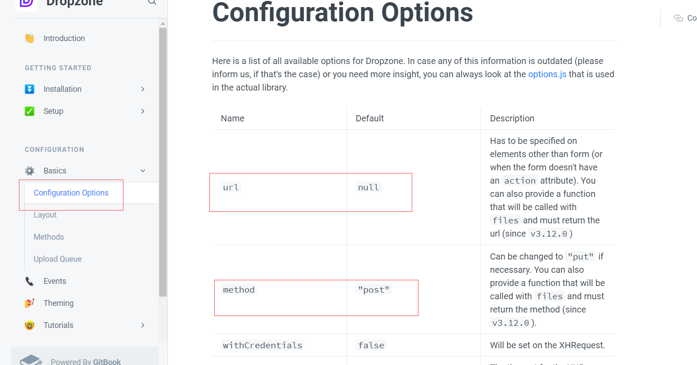

#### ssm框架之项目自我总结版

1.Category

>```
>@TableName("category")	 @TableId(type = IdType.AUTO)	 @JsonFormat(pattern = "yyyy-MM--dd HH:mm:ss")
>```

2.CategoryMapper

（extends BaseMapper<Category>都是MybatisPlus风格代码的体现）

>参数：void addCategory(Category category);		 返回值：List<Category> queryCategoryAll();

​	1）对于有多个参数的方法要么用@Param注解，但尽量用**实体类**作为参数

​	2）对于查询语句有返回值，其他语句可以没有设置为void

3.CategoryMapper.xml

>```
>命名空间：<mapper namespace="com.example.mapper.CategoryMapper">		
>注册别名：<typeAlias type="com.example.pojo.Category" alias="Category"/>
>```

一定要先运行SQL语句之后再写xml里面的SQL，减少出错率

​	* 日志文件收集

>```
> <settings>
>        <setting name="logImpl" value="STDOUT_LOGGING"/>
>        <setting name="mapUnderscoreToCamelCase" value="true"/>
><!--        <setting name="logImpl" value="LOG4J2"/>-->
>    </settings>
>  <dependency>
>            <groupId>org.apache.logging.log4j</groupId>
>            <artifactId>log4j-core</artifactId>
>            <version>2.18.0</version>
>  </dependency>
>  @Log4j2 log.debug log.error日志等级不同罢了
>```

4.CategoryService

>public class CategoryService extends ServiceImpl<categoryMapper ,Category> implements IcategoryServcie{}

必须实现接口，和cglib有关，提供AOP的功能 	context上下文，存放数据的容器

5.Controller

>post put 需要请求体：@RequestBody         /路径：@PathVariable	?路径：@RequestParam

6.RestFul风格请求

> URL分为4个部分

- 协议，http://
- 域名 + 端口 localhost:8080
- 路径，域名或者端口后面第一个斜杆与整个URL的第一个问号中间这一部分
- 参数，第一个问号后面的（表单以GET方式提交的参数都是以键值对的方式组织的）

它是使用URL（URI）来描述对某一个资源的某一种操作

|         | 请求类型 |                                                  |
| ------- | -------- | ------------------------------------------------ |
| /emp/id | GET      | 根据id来查询指定的资源                           |
| /emp    | GET      | 查询这个资源所有的                               |
| /emp/id | DELETE   | 根据id删除某一个资源                             |
| /emp    | POST     | 新增一个数据（提交的资源数据是封装在请求体中的） |
| /emp    | PUT      | 根据id来更新一个记录                             |

```
	@GetMapping("/emp/{id}")
    public Emp findById(@PathVariable("id") Integer employeeId){
        return null;
    }

    @GetMapping("/emp")
    public List<Emp> findAll(){
        return empService.findAll();
    }

    @PostMapping("/emp")
    public void save(@RequestBody Emp emp){
        empService.save(emp);
    }

    @PutMapping("/emp")
    public void update(@RequestBody Emp emp){
    }

    @DeleteMapping("/emp/{id}")
    public void deleteById(@PathVariable("id")int employeeId){
        System.out.println(employeeId);
    }
```

> SpringMVC框架获取前端提交数据的3个来源：

- URL的Param，这样的参数一般是以GET方式提交的，而且是键值对的结构（`username=root&password=admin`）
- URL的path，在获取的时候，需要在参数前面使用`@PathVariable`
- 从请求体中获取，需要借助`@ReqeustBody`（`POST`和`PUT`）

#### JS部分之项目自我总结版

1.查询所有：category列表(自我加载)

```js
let loadCategoryList = () => {
  const tb = $("#tb");
  tb.empty();
  $.get("/category/queryAll", (data) => {
    fillTbody(data, tb);
  });
};
loadCategoryList();
```

fillTbody函数

>字符串模板语法    JQUERY选择器

```js
let fillTbody = (categoryList, tb) => {
  let tr = null;
  for (const category of categoryList) {
    tr = $("<tr></tr>");
    tr.append(`<td>${category.id}</td>`);
    tr.append(`<td>${category.name}</td>`);
    tr.append(`<td>${category.comment}</td>`);
    const badge = category.state
      ? `<span class="badge badge-success">有效</span>`
      : `<span class="badge badge-danger">无效</span>`;
    tr.append(`<td>${badge}</td>`);
    tr.append(`<td>${category.createTime}</td>`);
    tr.append(`<td>${category.modifiedTime}</td>`);
    tr.append(
      `<button class="btn btn-primary btn-sm" type="button" data-bs-toggle="modal" data-bs-target="#modalForm" onclick="updateCategory(${category.id})" >更新</button><button class="btn btn-danger btn-sm" type="button" onclick="delCategory(${category.id})">删除</button>`
    );

    tb.append(tr);
  }
};
```

2.更新和新增：ajax异步提交请求不同，通过id是否存在来作区分

回显数据

>  $("#modalForm").modal("show");//显示弹窗
>
> $("#modalForm").modal("hide"); // 隐藏弹窗

```js
let updateCategory = (id) => {
  $("#modalForm").modal("show");
  let bean = null;
  if (id) {
    $("#modalTitle").text("更新");
    $.ajax({
      url: `/category/queryById/${id}`,
      type: "get",
      success: (data) => {
        //弹窗内容
        console.log(data);
        $("#id").val(data.id);
        $("#name").val(data.name);
        $("#comment").val(data.comment);
        $("#state").val(data.state);
      },
    });
  } else {
    $("#modalTitle").text("新增");
    $("#id").val("null");
    $("#name").val("");
    $("#comment").val("");
    $("#state").val("");
  }
};
```

保存：

> 请求体中的数据格式： data: JSON.stringify(data),
>
>contentType: "application/json;charset=utf-8",

```js
let saveOrUpdate = () => {
  $("#modalForm").modal("hide"); // 隐藏弹窗
  const id = $("#id").val();
  const name = $("#name").val();
  const comment = $("#comment").val();
  const state = $("#state").val();
  const data = { id, name, comment, state };//一定要注意析构后的对象值到底是怎样的存在
  console.log(id);
  if (id != "null") {
    console.log(id);
    $.ajax({
      url: `/category/update`,
      type: "put",
      data: JSON.stringify(data),

      success: (data) => {
        loadCategoryList();
      },
      contentType: "application/json;charset=utf-8",
    });
  } else {
    console.log(1);
    $.ajax({
      url: `/category/add`,
      type: "post",
      data: JSON.stringify(data),
      success: (data) => {
        loadCategoryList();
      },
      contentType: "application/json;charset=utf-8",
    });
  }
};

```

特殊问题特殊处理

1.获取到的键值对并不是{id:1，id:2},而是{0:1,1:1}

```js
const dd = [];//数组里面存对象
  for (const item of categoryList1) {
    dd.push({ id: item });//把categoryList的值以我所需要求存进去
  }
  // console.log(categoryIds);

  const data = {
    id,
    title,
    description,
    detail,
    status,
    state,
    categoryList: dd,//将dd变量重命名为categoryList
  };
```

常见的请求错误：

404 - 没有找到文件或目录

405 - 用来访问本页面的 HTTP 谓词不被允许（方法不被允许） 

500 - 内部服务器错误

#### 官方文档之项目自我总结版（图片的上传dropzone）

一定要学着慢慢看文档

1.快速开始之搭建环境



form表单不可以嵌套

2.教程之拿取自己想要的东西（微微懂个大概）

ctr+f搜索自己想找的

ctr+table切换文件

ctr+e全局搜索编写的文件



#### MybatisPlus的再学习

```java
public interface EmpMapper extends BaseMapper<Emp> {

    // @Select("select * from employees")
    List<Emp> findAll();

    void save(Emp emp);

    // @Select("select * from employees where first_name=#{firstName} and last_name=#{lastName}")
    Emp checkLogin(Emp emp);

    // Emp findById(Integer employeeId);
}
```

Mapper映射文件

```xml
<?xml version="1.0" encoding="UTF-8" ?>
<!DOCTYPE mapper
        PUBLIC "-//mybatis.org//DTD Mapper 3.0//EN"
        "http://mybatis.org/dtd/mybatis-3-mapper.dtd">
<mapper namespace="com.example.mapper.EmpMapper">

    <!--Mybatis框架在通过spring-db.xml中的mapperLocations属性指定的路径中得到映射文件的路径以后，会全部加载并解析这些映射文件-->
    <!--上述这个动作实际上是Mybatis通过Spring完成的-->
    <!--接下来它会把这个映射文件根据命名空间的声明，找到对应的Mapper接口，将各个SQL的id与Mapper接口中的各个方法对应上-->
    <select id="findAll" resultType="Emp">
        select * from employees
    </select>

    <insert id="save" parameterType="Emp">
        insert into employees values(null,#{firstName},#{lastName},#{jobTitle},#{salary},#{reportsTo},#{officeId})
    </insert>

    <select id="checkLogin" parameterType="Emp" resultType="Emp">
        select * from employees where first_name=#{firstName} and last_name=#{lastName}
    </select>

</mapper>
```

> Mybatis根据命名空间来绑定相应的Mapper接口和Mapper文件

- 告诉spring框架，映射文件的路径在哪

  ```xml
  <property name="mapperLocations" value="classpath*:/mybatis/*Mapper.xml"/>
  ```

- 告诉spring框架，Mapper接口放在哪个包

  ```xml
  <property name="basePackage" value="com.example.mapper"/>
  ```

- 命名空间的值，必须和被绑定的Mapper接口的完整名称保持一致

#### ssm框架整合步骤版

Spring + SpringMVC + Mybatis

整合步骤：

1. 添加相关的依赖

   ```xml
           <!-- https://mvnrepository.com/artifact/mysql/mysql-connector-java -->
           <dependency>
               <groupId>mysql</groupId>
               <artifactId>mysql-connector-java</artifactId>
               <version>8.0.30</version>
           </dependency>
   
           <!-- https://mvnrepository.com/artifact/org.projectlombok/lombok -->
           <dependency>
               <groupId>org.projectlombok</groupId>
               <artifactId>lombok</artifactId>
               <version>1.18.24</version>
               <scope>provided</scope>
           </dependency>
   
   		<dependency>
               <groupId>org.springframework</groupId>
               <artifactId>spring-jdbc</artifactId>
               <version>${springmvc.version}</version>
           </dependency>
           <dependency>
               <groupId>com.baomidou</groupId>
               <artifactId>mybatis-plus</artifactId>
               <version>3.5.2</version>
           </dependency>
   ```

2. 增加Mybatis-plus配置

   ```xml
   <!--配置数据源-->
   <bean id="ds" class="org.springframework.jdbc.datasource.DriverManagerDataSource">
       <property name="driverClassName" value="com.mysql.cj.jdbc.Driver"></property>
       <property name="url" value="jdbc:mysql://localhost:3306/sql_hr?rewriteBatchedStatements=true&amp;serverTimezone=GMT%2B8&amp;characterEncoding=utf8"></property>
       <property name="username" value="root"></property>
       <property name="password" value="admin"></property>
   </bean>
   
   <!--配置Mybatis的SqlSessionFactoryBean-->
   <bean id="sqlSessionFactory" class="com.baomidou.mybatisplus.extension.spring.MybatisSqlSessionFactoryBean">
       <property name="dataSource" ref="ds"/>
   </bean>
   
   <!-- 配置MapperScan：用来扫描用户自定义的mapper接口 -->
   <bean class="org.mybatis.spring.mapper.MapperScannerConfigurer">
       <property name="basePackage" value="com.example.mapper"/>
   </bean>
   ```

3. 准备好DB的表及实体类

   ```java 
   @Data
   @AllArgsConstructor
   @NoArgsConstructor
   @TableName("employees")
   public class Emp {
       
       @TableId(type = IdType.AUTO) // 表示主键是自增长
       private Integer employeeId;
       // @TableField("first_name")
       private String firstName;
       private String lastName;
       private String jobTitle;
       private Integer salary;
       private Integer reportsTo;
       private Integer officeId;
       
   }
   ```

4. 开发Mapper（对应之前的Dao）

   ```java
   public interface EmpMapper extends BaseMapper<Emp> {
   }
   ```

5. 开发Service

   ```java
   @Service
   public class EmpService {
   
       @Autowired
       private EmpMapper empMapper;
   
       public List<Emp> findAll() {
           QueryWrapper<Emp> queryWrapper = new QueryWrapper<Emp>();
           // queryWrapper.eq("username", "root");
           // UpdateWrapper<Emp> up = new UpdateWrapper<Emp>();
           // up.eq("employee_id", 1);
           // empMapper.update(emp, up);
           return empMapper.selectList(queryWrapper);
       }
   }
   ```

6. 开发controller

   ```java
   @RestController
   public class EmpController {
   
       @Autowired
       private EmpService empService;
   
       @GetMapping("/findAll")
       public List<Emp> findAll(){
           List<Emp> list = empService.findAll();
           System.out.println(list);
           return list;
       }
   
   }
   ```

7. 添加JSON支持

   ```java
   <dependency>
       <groupId>com.fasterxml.jackson.core</groupId>
       <artifactId>jackson-databind</artifactId>
       <version>2.11.3</version>
   </dependency>
   ```

#### 必问两道面试题

##### Spring Core

Spring是一个`bean`的容器框架。（`bean`就是能提供服务或者功能的类）Spring主要在系统中承担这样的一些职责：

- 管理`bean`的生命周期（负责创建和销毁这些`bean`）
- 负责调度`bean`来提供服务
- 维护和管理多个`bean`之间的关系

由此，Spring官宣的主要特性：

- IoC，Inverse of Control，称为控制反转
- DI，Dependency Injection，依赖注入
- AOP，Aspect-Oriented Promgramming，面向切面编程

#####  IoC

控制反转，以前是由开发人员自己来创建和销毁对象的，但是在使用`Spring`的时候，可以把这个工作交给`Spring`容器来处理

**基于XML风格**

准备一个配置文件

```
<?xml version="1.0" encoding="UTF-8"?>
<beans xmlns="http://www.springframework.org/schema/beans"
       xmlns:xsi="http://www.w3.org/2001/XMLSchema-instance"
       xsi:schemaLocation="
       http://www.springframework.org/schema/beans
       http://www.springframework.org/schema/beans/spring-beans.xsd">
    <!-- 对于⼀个xml⽂件如果作为框架的配置⽂件，需要遵守框架的配置规则 -->
    <!-- 通常⼀个框架为了让开发者能够正确的配置，都会提供xml的规范⽂件（dtd\xsd） -->

    <!--    配置service这个bean-->
    <bean id="helloService" class="com.example.springbootdemo.ioc.xml.HelloService"></bean>
</beans>
ClassPathXmlApplicationContext context = new ClassPathXmlApplicationContext("spring/config.xml");
// 根据id来获取对应bean的实例
HelloService helloService = (HelloService) context.getBean("helloService");
helloService.hello();
```

容器还提供了一些其他功能特性：

- 单例模式
- 根据配置调用指定的初始化和销毁方法

**基于注解方式**

@RestController @Service

##### DI

三种：构造器、setter、接口注入