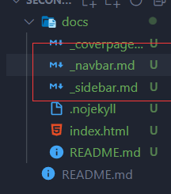

# 个人博客

## 1.快速搭建

### **1.1 github 创建仓库，克隆仓库到本地**

### **1.2 直接 quick-start 上手**

**docsify 官方文档https://docsify.js.org/#/**

```
//全局安装
npm i docsify-cli -g
//初始化docs项目
docsify init ./docs
//启动服务，端口跳转
docsify serve docs
```

### **1.3 第一次提交commit本地仓库、推送push远程仓库（应备注相关信息提交）**

### **1.4 git 设置为 pages，访问网址后缀名.github.io**



## 2.简单制作

### **2.1 为 index.html (入口文件)添加 script**

```html
<script>
  window.$docsify = {
    name: "JavaNotes",
    repo: "https://github.com/name-rabbit/notes.github.io",
    loadSidebar: true, //侧边栏
    loadNavbar: true, //导航栏
    coverpage: true, //主封面
    subMaxLevel: 2, //允许最大的侧边栏缩进条数
  };
</script>
```

### **2.2 新建三个文件**


### **2.3 导航条或侧边栏的文件导入**

```
- [导航名字](文件路径 标题名)
- [Home](/ "Home")
```

### **2.4 图片导入**

```


```

### **2.5 链接**

```
[链接名称](链接地址)
```

### **2.6 列表**

```
1. 第一项：
    - 第一项嵌套的第一个元素
    - 第一项嵌套的第二个元素
```

### **2.7 区块**

```
 > 菜鸟教程
```

### **2.8 代码**

```
​```javascript
$(document).ready(function () {
    alert('RUNOOB');
});
​```
```

### **2.9 表格**

```
| 左对齐 | 右对齐 | 居中对齐 |
| :-----| ----: | :----: |
| 单元格 | 单元格 | 单元格 |
| 单元格 | 单元格 | 单元格 |
```

## 3.Typora的搭配使用

### 基本设置

文件->偏好设置

​							->图片相对路径

​							->开启调试模式

​							->打开主题文件夹

```
github主题样式地址：

链接：https://pan.baidu.com/s/1vZJ241FTNpKFAgONzG7EWA 

提取码：jtf5
```

