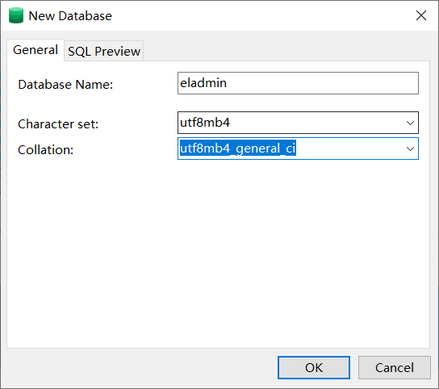

# 如何分析开源项目

学习过程：javase-前端入门-mysql-javaweb-ssm等框架-微服务

学习方式：让开源项目跑起来 	举例：eladmin  https://eladmin.vip/

选择：gitte或github开源项目中最多star的

## 1.观察开源项目

### 后端

### 前端

## 2.开源项目下载与运行

> 观察：
>
> 1.用了哪些技术
>
> 2.是否有数据库
>
> 3.你的环境是否匹配
>
> 通过后，再想办法运行，切记跑起来只是第一步

- 安装数据库，执行sql 

- 前端跑起来 npm install，以及redis集群服务启动

- 后端项目导入跑起来，然后等待所有的都成功完成

只要发现了Swagger，那么跑起来的第一步就是先进入Swagger-ui页面!因为这里面都是接口!

进而查看配置文件!默认端口，有哪些配置，需要改为自己的项目和环境地址!
前端就是安装依赖，启动测试运行，看接口是否正常!

> api

应用程序编程接口（Application Programming Interface）,一些**预先定义的函数**，或指软件系统不同组成部分衔接的约定。用来提供应用程序与开发人员基于某软件或硬件得以访问的一组例程，而又无需访问原码，或理解内部工作机制的细节。

作用：我们通过API接口可以**实现特定的功能**，而不需要了解其内部实现细节。可以把API接口理解为是特定服务的一种封装，将服务封装起来**提供给他人调用**，这样一来很多功能不需要从新开发。

## 3.前后端项目分离

1、从前端开始分析。打开控制台，点一个接口，分析一波调用关系!

2、前后端端口调用不一致~8013 -- 8000，怎么操作的

`重点：找到接口调用的问题`

springboot提供服务，前端调用接口数据，vue负责渲染页面

> SpringBoot是一个服务于框架的框架，服务范围是简化配置文件。
>
>Spring框架这个大家族中,比如 Spring、SpringMvc框架等，Spring的核心内容在于控制反转(IOC)和依赖注入(DI),所谓控制反转并非是一种思想，在操作方面是指在spring配置文件中创建<bean>，依赖注入即为由spring容器为应用程序的某个对象提供资源

> 从前端开始分析url以及import组件啥的，看接口是如何调用的
>
> 具体如何渲染，看前端，
>
> console.log打印查看，network抓包url
>
> url可以ctr+f在后端全局查找
>
> 后台代码：controller-service-dao模式

