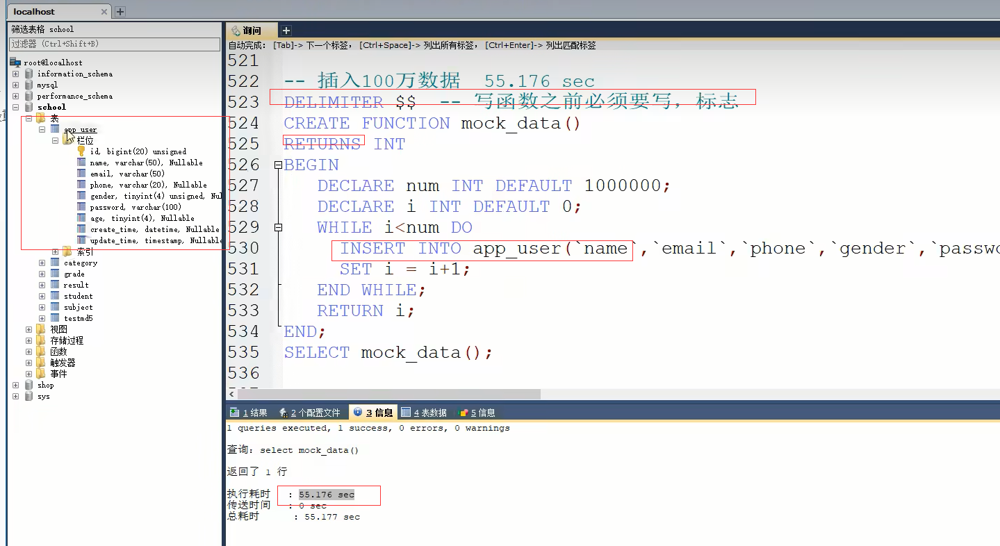

数据库

> 索引(Index)是帮助MySQL高效获取数据的数据结构。0.5s	 0.00001s

- 主键索引（PRIMARY KEY）
  - 唯一的标识，主键不可以重复，只能有一个列作为主键
- 唯一索引（UNIQUE KEY）
  - 避免重复的列出现，唯一索引可以重复，多个列都可以标识唯一索引
- 常规索引（KEY/INDEX）
  - 默认的index,key关键字来设置
- 全文索引
  - 在特定的数据库引擎才有，MYISAM
  - 快速定位数据

