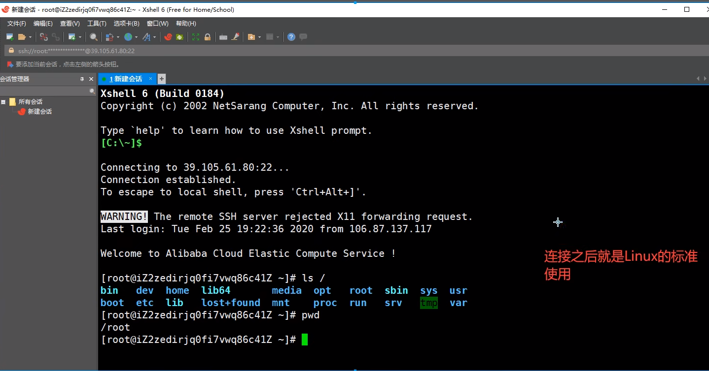
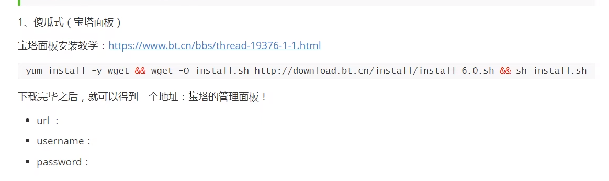
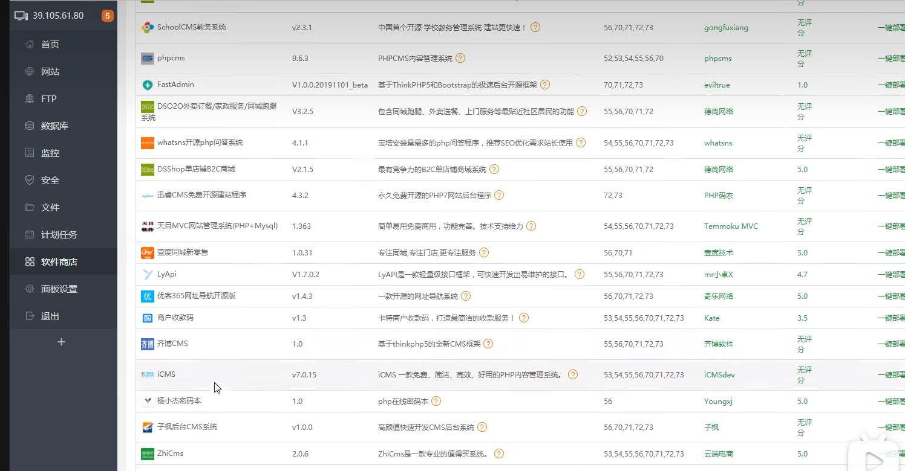
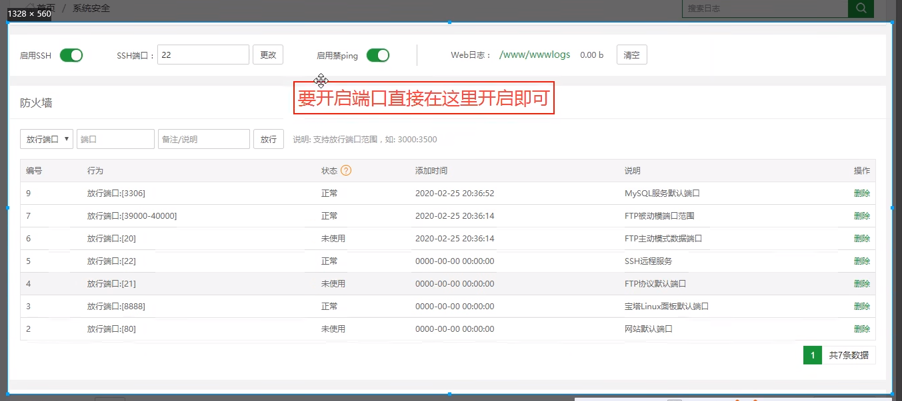

服务器

> 为什么程序员都需要一个自己的服务器

1、你作为一个程序员，必须要发布自己的网站和项目!2、练习Linux操作
3、自己的远程仓库、远程数据库、远程tomcat......搭建在服务器上
4、练习，Linux进行任意的环境部署操作! Window下开发，你不熟悉Linux。

> 看哪里：学生机和优惠力度

2.

3、

>连接到服务器之后需要搭建环境，一键部署应用

软件商店直接安装

开启端口

放入网站进行访问!
比如tomcat就直接放到webapps目录下!特殊的网站:开源项目，就按照自己操作来!
上传文件尽量使用XFTP

> 网站如果访问测试失败，一定是防火墙，( Linux服务器，阿里云安全组面板! |)
> war直接丢到tomcat即可
> jar直接用java -jar执行即可访问