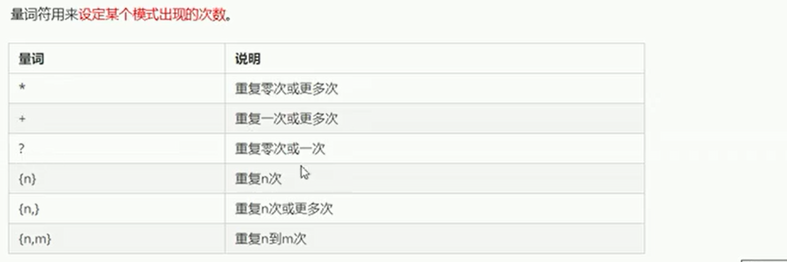
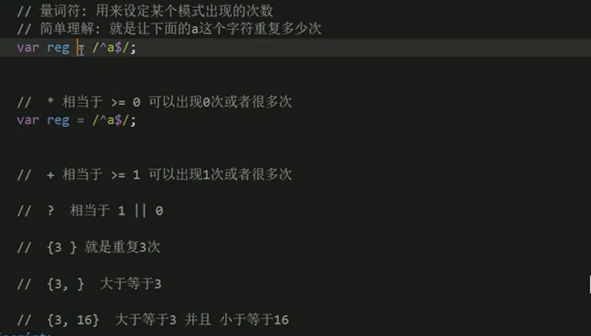

# 正则表达式

表达式：匹配、替代、提取

正则表达式在JS中的使用


正则表达式中的特殊字符


量词






案例


```
<!DOCTYPE html>
<html lang="en">
<head>
    <meta charset="UTF-8">
    <meta http-equiv="X-UA-Compatible" content="IE=edge">
    <meta name="viewport" content="width=device-width, initial-scale=1.0">
    <title>Document</title>
</head>
<body>
    <input type="text" class="uname"><span>请输入用户名</span>
    <script>
        var reg =/^[a-zA-Z0-9_-]{6,16}$/;
        var uname=document.querySelector(".uname");
        var span = document.querySelector('span');
        uname.onblur=function(){
            if(reg.test(this.value)){
                console.log('正确的');
                span.className='right';
                span.innerHTML='用户名输入正确';
            
            }else{
                console.log('错误的');
                span.className='wrong';
                span.innerHTML='用户名输入错误'
            }
        }
    </script>
</body>
</html>
```


预定义类：


