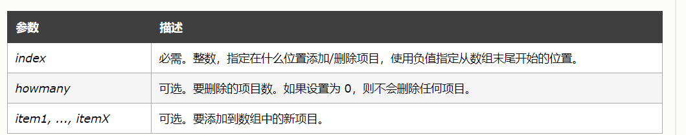
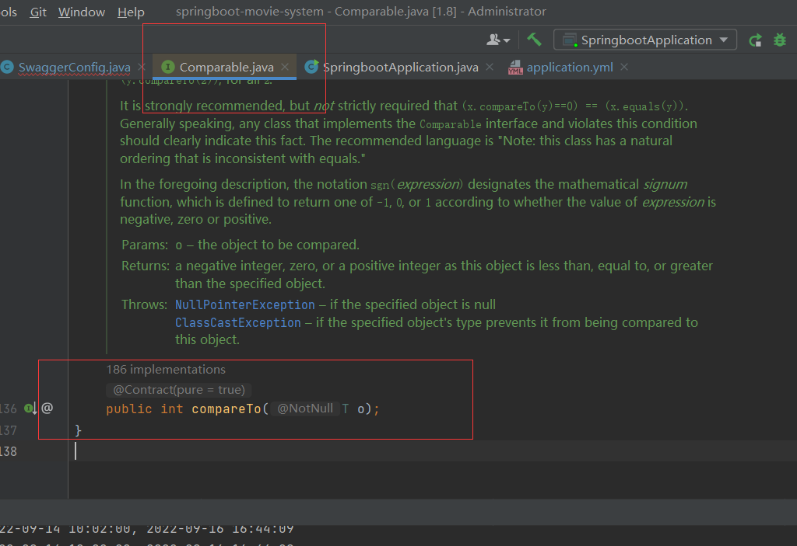
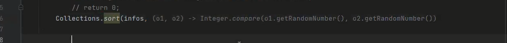
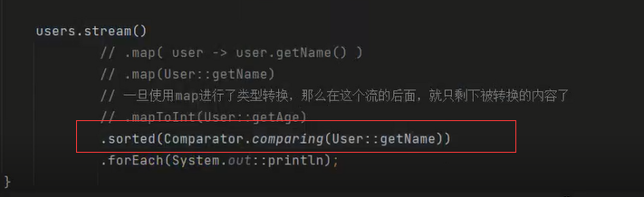
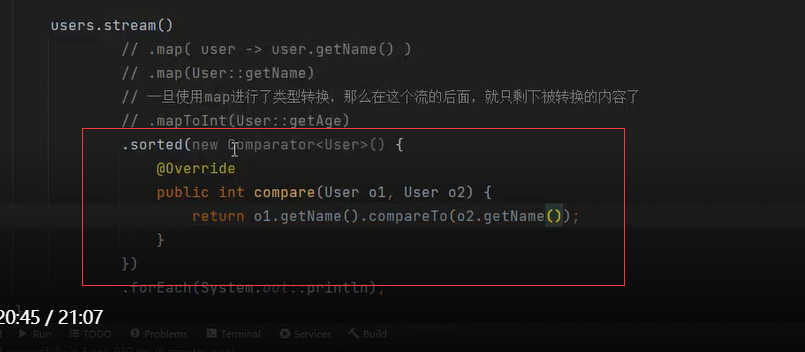
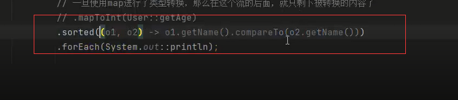

知识盲区

#### JVM快速入门：

https://www.kuangstudy.com/bbs/1557549426359590914

#### 深思钩子函数的与回调函数的区别

1.钩子函数与回调函数都是事件处理函数

 2.钩子函数是指windows的消息处理机制下，**捕获消息的时候**立即执行

 3.回调函数并不能参与消息处理的过程，所以，它是在**消息捕获结束后**才执行的函数

钩子函数

```js
$('button').click(()=>{
console.log('我被点击了!')
})
```

回调函数

```js
$("p").on("click", function(){
alert( $(this).text() );
});
```

my:回调就是函数里面调函数

#### for of与 for in的区别：

of取到的是value值,in取到的是map集合的key

#### filter与map流式编程的区别：

filter参数是断言型接口，map参数是函数型接口

#### reduce累加器

(累加结果, 当前值, 当前索引，array)=>{ 	return 处理结果 }

#### splice添加删除



#### Swagger

是一个功能强大的接口管理工具，用于生成、描述、调用和可视化RESTful风格的Web服务


#### classpath 和 classpath\* 区别：** 

classpath：只会到你的class路径中查找找文件; 
classpath*：不仅包含class路径，还包括jar文件中(class路径)进行查找. 

**双重检测锁模式的 懒汉式单例（DCL懒汉式）**

```
package lin.single;
 
//懒汉式单例
public class LazyMan {
    private LazyMan(){
        System.out.println(Thread.currentThread().getName()+" ok!");
    }
 
    private volatile static LazyMan lazyMan;
 
    //双重检测锁模式的 懒汉式单例模式 俗称（DCL懒汉式）
    public static LazyMan getInstance(){
        if (lazyMan == null) {
            synchronized (LazyMan.class){
                if (lazyMan == null) {
                    lazyMan = new LazyMan(); //不是原子性操作
                    /*
                    * 1、分配内存空间
                    * 2、执行构造方法，初始化对象
                    * 3、把这个对象指向这个空间
                    * */
                }
            }
        }
        return lazyMan;
    }
 
    public static void main(String[] args) {
        for (int i = 0; i < 10; i++) {
            new Thread(()->{
                LazyMan.getInstance();
            }).start();
        }
    }
}
```

#### ForkJoin

大任务拆分成一个个的小任务，再把结果收集起来

#### 两个接口Comparator与Comparable



Integer.compare(o1.getNum(),02.getNum)







