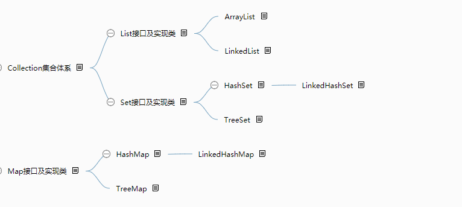
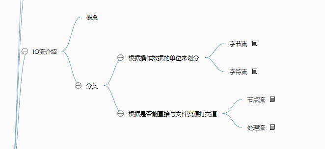
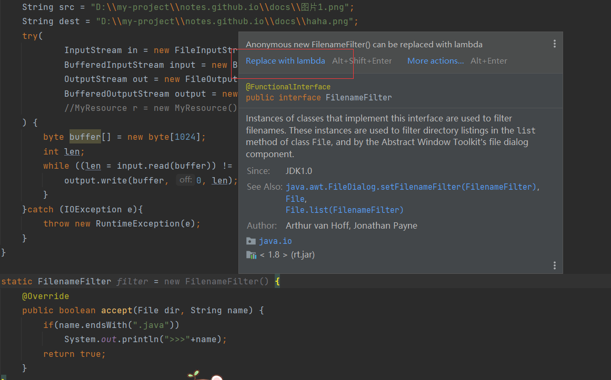
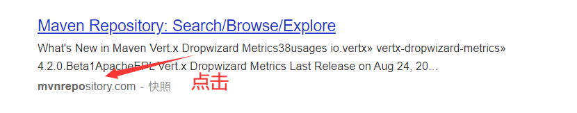
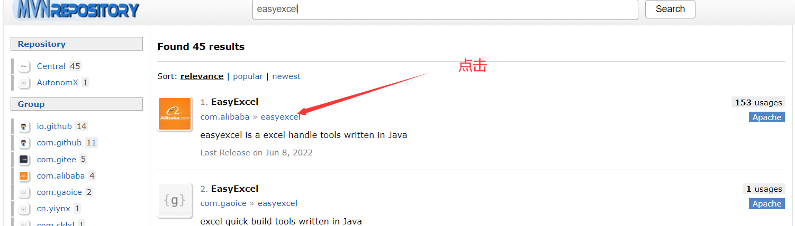
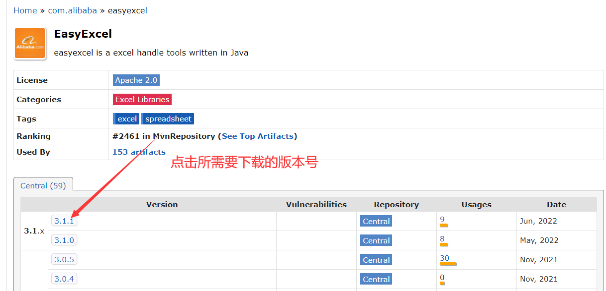
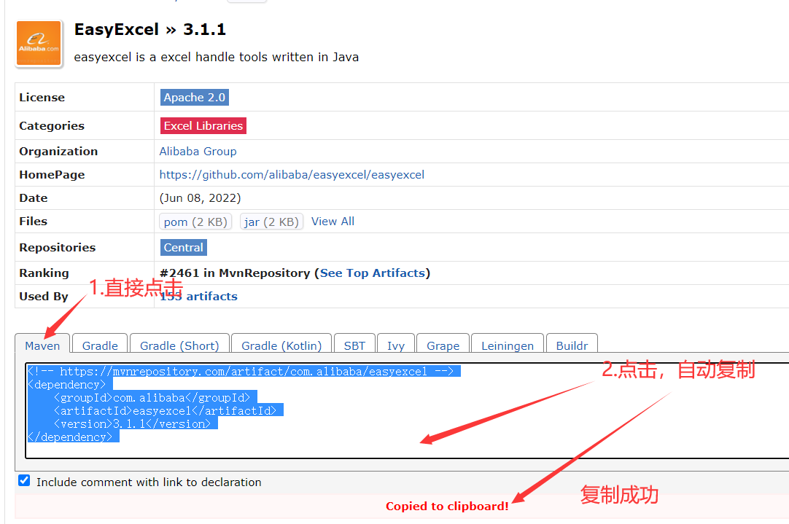
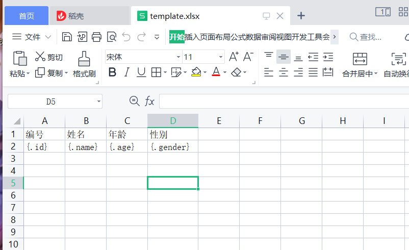
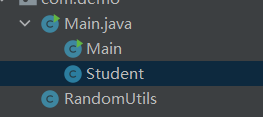

# 集合

1.分类

（1）ArrayList特点：

1.基于数组实现的

2.随机查找速度快，因为是根据索引来找到某一个冤死的，索引等效于内存地址

3.随机插入和删除的速度较慢，因为需要挪位置





# 异常

1.分类


# IO流

## 1.分类

字节流：以Stream结尾

字符流：输入流都是以Reader结尾，输出以Writer结尾

节点流：直接与资源打交道 FileInputStream 、FileOutputStream 、FileReader、FileWriter

处理流：BufferedXXXX

注意：缓冲流、节点流、处理流（它不能直接和文件打交道)

## 2.问：（一个字符=2个字节（二进制方式存储））

字节流能否操作这个以字符为单位记录信息的文件呢?可以的，但是比直接用字符流操作速度要慢

对于二进制的文件，能否用字符流来操作呢?不可以




## 匿名内部类补充（一）

接口名就是类型，而{}中的逻辑，就是一个动态代码块，里面是接口中所有抽象方法的具体实现

```java
  static FilenameFilter filter = new FilenameFilter() {//FilenameFilter是一个接口，需要对其抽象方法做具体的实现
         @Override
         public boolean accept(File dir, String name) {
             if (name.endsWith(".java"))
                 System.out.println(">>>>" + name);
             return false;
         }
     };
```


*鼠标悬停，可以自动生成Lamda表达式



```java
 static FilenameFilter filter = (dir, name) -> {
        if(name.endsWith(".java"))
            System.out.println(">>>"+name);
        return true;
    };//结尾有分号要注意;
//使用匿名内部类的对象filter
 private static void treeWalk(String path) {
        File file = new File(path);
        if (file.isFile()) System.out.println(file.getName()); // 获取文件的简单名称
        else {
            File[] children = file.listFiles(filter); // 获取当前文件夹下面的子文件信息
            for (File f : children) {
                treeWalk(f.getAbsolutePath()); // 获取文件的完成路径
            }
        }
```


closeable接口实现关闭流对象

```java
class MyResource implements Closeable {

    @Override
    public void close() throws IOException {
        System.out.println("关闭中...");
    }

}
```

## mvnrepo与EasyExcel使用补充（二）

例：批量填写excel表格

1.搜索mvnrepo，点击mvnrepository.com(可直接跳过至第5步)



2.搜索EasyExcel,点击阿里巴巴贡献的EasyExcel



3.点击你所需要的EasyExcel版本



4.复制仓库坐标进行pom.xml的导入



5.创建Maven项目，等待自动加载完成


6.在pom.xml里新建标签<dependecies></dependencies>将坐标复制粘贴到pom.xml里面

```
<!--添加第三方库  -->
    <dependencies>
      <!-- https://mvnrepository.com/artifact/com.alibaba/easyexcel -->
      <dependency>
        <groupId>com.alibaba</groupId>
        <artifactId>easyexcel</artifactId>
        <version>3.1.1</version>
      </dependency>
    </dependencies>
```


7.EasyExcel使用网址：https://easyexcel.opensource.alibaba.com/docs/current/，创建一个excel表格如下图



8.编写代码



（1）RandomUtils工具类：

```java
package com.demo;

import java.util.Random;

public class RandomUtils {

    // Utility 工具

    // CTRL + SHIFT + U 批量转换大小写
    // static 修饰的内容，是不依赖于这个类的任何实例的，当这个类一旦在运行期间加载进来，它就已经存在，有且只有一份，大家共享的
    // static修饰的方法只能访问static修饰的变量
    private final static String data = "ABCDEFGHIJKLMNOPQRSTUVWXYZabcdefghijklmnopqrstuvwxyz"; // 字典数据
    private static final Random ran = new Random(); // 对于引用类型，只要它自己的地址不发生改变，也可以修饰为final的

    // private static final String[] genders = new String[]{"male, female"};
    private static final String[] genders = {"male", "female"}; // 利用了编译器的优化机制(语法糖)进行简化，和上面这一行等效

    /**
     * <p>生成步骤</p>
     * <ul>
     *     <li>对字典字符串拆分，得到一个字符数组</li>
     *     <li>产生某一个合适范围的索引值</li>
     *     <li>把字符数组变换成一个完整的字符串</li>
     * </ul>
     *
     * @param len 表示要生成的字符串长度
     * @return 返回一个随机内容的字符串
     */
    public static String randomString(int len) {
        // String[] split = data.split("");
        char[] chars = data.toCharArray(); // 'A'
        // 循环从split数组中随机获取一个字符，然后组装成一个完整字符串
        // 创建一个临时存放零散字符的数组
        char[] temp = new char[len]; // 用来构造一个完整的字符串的
        for (int j = 0; j < len; j++) {
            char c = chars[ran.nextInt(data.length())]; // [0, data.length())
            temp[j] = c;
        }
        return new String(temp); // 不使用字符串的拼串是因为会产生大量的内存零时垃圾
    }

    public static String randomString() {
        return randomString(5); // 重用上面的逻辑
    }

    /**
     * 产生从from到to之间的某一个数字，包左，不包右
     *
     * @param min 最小值
     * @param max 最大值
     */
    public static int randomNumber(int min, int max) { // 3 - 10
        if (max < min) {
            System.out.printf("%d 不能 比 %d 小\r\n", max, min);
        }
        return ran.nextInt(max - min) + min;
    }

    /**
     * 产生从 1 到to之间的某一个数字，包左，不包右
     *
     * @param max 最大值
     */
    public static int randomNumber(int max) {
        return randomNumber(1, max);
    }

    public static String randomGender() {
        // return ran.nextBoolean() ? "male" : "female";
        int index = ran.nextInt(2); // 0 1
        return genders[index];
        // return genders[ran.nextInt(2)];
    }
}

```

（2）Main测试类和Student封装类：

```java
package com.demo;

import com.alibaba.excel.EasyExcel;

import java.util.ArrayList;
import java.util.List;

import static com.demo.RandomUtils.*;

public class Main {
    public static void main(String[] args) {
        //原来创建的excel表格路径
        String path = "C:\\Users\\Administrator\\Desktop\\template.xlsx";
        //批量生成后的excel表格路径
        String dest ="C:\\Users\\Administrator\\Desktop\\template2.xlsx";
        //EasyExcel使用
       EasyExcel.write(dest).withTemplate(path).sheet().doFill(data());
    }

    static List<Student> data(){
        List<Student> list = new ArrayList<Student>();
        for (int i = 0; i < 100; i++) {
            list.add(new Student(i,randomString(),randomNumber(100),randomGender()));
        }
        return  list;
    }
}
class  Student{
    int id;
    String name;
    int age;
    String gender;

    public Student() {
    }

    public Student(int id, String name, int age, String gender) {
        this.id = id;
        this.name = name;
        this.age = age;
        this.gender = gender;
    }

    public int getId() {
        return id;
    }

    public void setId(int id) {
        this.id = id;
    }

    public String getName() {
        return name;
    }

    public void setName(String name) {
        this.name = name;
    }

    public int getAge() {
        return age;
    }

    public void setAge(int age) {
        this.age = age;
    }

    public String getGender() {
        return gender;
    }

    public void setGender(String gender) {
        this.gender = gender;
    }
}

```

